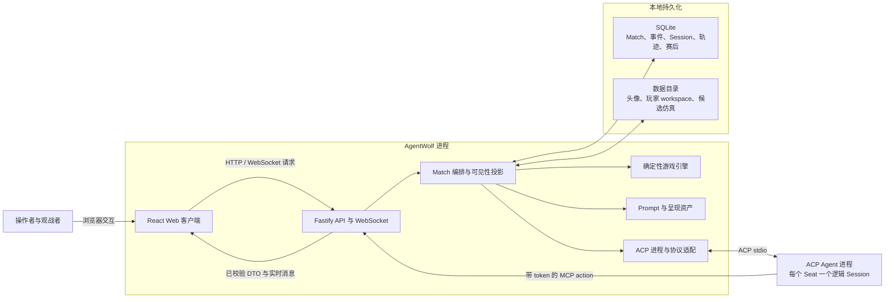
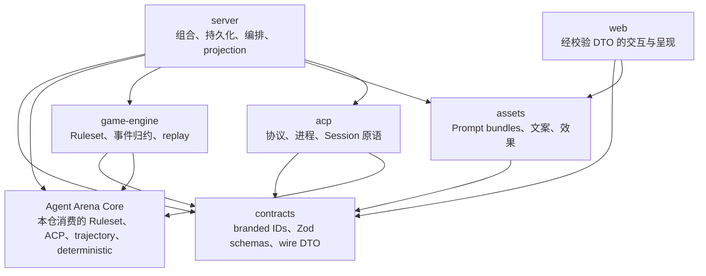
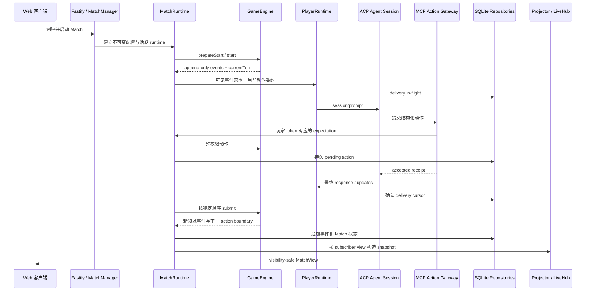

# AgentWolf 系统架构设计

本文面向维护 AgentWolf 运行时、规则插件、Agent 集成和 Web 客户端的研发人员，描述系统边界、
主要组件、一次 Match 的端到端链路、跨模块状态所有权和扩展约束。包内 API 由各 package/app
README 负责，规则、Session、同步、生命周期、轨迹、仿真和浏览器机制由对应专项架构文档负责。

## 设计目标与约束

AgentWolf 把多名长驻 ACP Agent 组织成一场可恢复、可观战的狼人杀对局。系统结构同时满足以下
目标：

- **确定性规则**：相同 board、Ruleset lock、事件和动作顺序产生相同状态与胜负结果。
- **隐藏信息安全**：Role、阵营行动、私密阶段和诊断状态在 server 序列化前完成过滤，浏览器和
  Prompt 模板只消费已经授权的事实。
- **持久玩家认知**：一个 Seat 在整场 Match 与赛后流程中绑定一个逻辑 ACP Session；进程可以
  重启，Session 身份和已送达上下文不能漂移。
- **并行但不泄密**：并行阶段可以同时驱动多个 Agent，但动作与完成顺序在 barrier 落定前保持
  密封，最终按稳定 Seat 顺序进入引擎。
- **流式可观察**：Agent 发言、Session 状态、领域事件和赛后感想可以实时呈现；最终提交与重放
  仍以持久事实为准。
- **可恢复与可审计**：server 可以从不可变快照、append-only 事件、Session 绑定和 delivery
  台账恢复；trajectory 提供语义审计，simulation 提供确定性回归。
- **插件化语义**：Ruleset plugin 拥有具体 Role、Ability、Phase、事件、效果和 Prompt 贡献，
  通用内核与中央编排不按具体语义 ID 分支。

## 系统上下文

下图说明浏览器、Agent 进程、AgentWolf 进程和本地持久化之间的边界。Agent 进程通过 ACP stdio
接收 Prompt，通过带玩家 token 的 MCP HTTP 工具提交结构化动作；它们不直接访问 Match 状态或
SQLite。

Fastify 是外部网络入口和应用组合根。确定性引擎位于 IO 边界内侧，只接收已经解析的配置和动作。
SQLite 保存恢复所需的权威记录；WebSocket、当前进程中的 GameState、Agent 子进程和浏览器队列都
是可以从持久事实或当前连接重新建立的运行态对象。

## 组件与依赖方向

系统按共享契约、纯规则、通用协议、呈现资产、应用编排和浏览器消费分层。下面的箭头表示源码
依赖方向，架构门禁会拒绝反向 import。

| 组件                                                                | 主要职责                                                                                     | 稳定边界                                                |
| ------------------------------------------------------------------- | -------------------------------------------------------------------------------------------- | ------------------------------------------------------- |
| [Agent Arena Core](../vendor/agent-arena-core/docs/architecture.md) | 提供规则、ACP、Prompt、Match 编排、存储、trajectory、simulation 与验证基础机制               | 本仓只通过固定 revision 的公开入口选择性消费            |
| [`contracts`](../packages/contracts/README.md)                      | 定义跨 JSON、数据库、进程和浏览器边界的 IDs、动作、事件、配置、视图与诊断 schemas            | 不求值规则、不执行 IO、不拥有 UI 或编排                 |
| [`game-engine`](../packages/game-engine/README.md)                  | 组合狼人杀 registries,校验动作,推进 phase 图,结算 effects,发出事件并重建状态                 | 依赖 AgentWolf contracts 与固定 Core revision;保持无 IO |
| [`assets`](../packages/assets/README.md)                            | 持有 plugin-owned Prompt、玩家 Skills、本地化文案、Character 与 Role 效果定义                | server-only Prompt/Skill 入口与浏览器安全导出分离       |
| [`acp`](../packages/acp/README.md)                                  | 绑定 Agent Tool catalog、Provider launch policy、玩家隔离配置与 Core ACP runtime             | Match phase、仓库与恢复决策由 server 持有               |
| [`server`](../apps/server/README.md)                                | 组合所有下层模块，拥有 Match 生命周期、SQLite、Agent 回合、MCP gateway、可见性投影和实时连接 | 是唯一应用组合根和隐藏信息序列化边界                    |
| [`web`](../apps/web/README.md)                                      | 校验 REST/WebSocket DTO，组合页面，持有浏览器副作用与本地呈现状态                            | 不执行规则、持久化、Prompt 渲染或授权过滤               |

`server` 内部继续按稳定职责拆分：`MatchManager` 管理活跃 runtime 与恢复，`MatchRuntime` 驱动
回合，`PlayerRuntime` 管理单个 Seat 的 delivery，repositories 管理持久状态，projector 构造
观看者视图。它们共享 contracts，但不能建立第二套规则状态或 Session 历史。

当前直接消费边界是：game-engine 使用 Core contracts/ruleset/game-runtime；acp package 使用 Core
acp-runtime；server 使用 Core trajectory。Core 的 prompt-runtime、match-runtime、store ports、
storage-sqlite、harness 与 testkit 已作为独立平台能力存在，但不参与当前 AgentWolf Match 运行链；
AgentWolf 仍由 assets、MatchRuntime、现有 repositories 与仓库 harness 持有对应产品职责。

## 控制面与事实流

系统将“如何运行一场 Match”与“Match 已经发生什么”分开：

- **控制面**由 Agent Tool/Profile、board、Character、全局 settings、Ruleset catalog 和 server
  启动配置组成。创建 Match 时，影响既有对局的部分被解析为不可变 setup 与 board snapshot。
- **领域事实流**是引擎发出的 append-only `GameEvent`。事件带 Match 内序列号和 visibility，
  GameState、Prompt 增量、浏览器 timeline 与 replay 都从这条流派生。
- **Agent 送达流**由每玩家 delivery ledger、ACP stream、pending action 和 Session binding
  组成。它记录模型看到了哪段可见事实以及动作是否已经持久接受。
- **诊断流**由 trajectory turns/records 组成。它观察 Prompt、Session、delivery 与领域事件的
  一致性，但不成为游戏规则或 Match 恢复的输入。
- **回归流**由 simulation candidates、双 runner 结果和 approved fixtures 组成。它只读消费生产
  事实，并为测试保存经过审查的确定性 oracle。

这些流使用同一个 Match/Player 身份关联，但拥有不同的提交语义。领域事件决定游戏事实；delivery
决定模型上下文进度；trajectory 只记录和审计二者是否一致；simulation 将经过筛选的稳定事实转为
测试输入和 oracle。

## 一次 Match 回合的端到端链路

下图以结构化动作回合为主线。顺序发言还会在 ACP response stream 与浏览器之间传送文本分块，
并可能在最终 `speech.committed` 后等待播报完成；这一同步机制由专项文档解释。

关键提交点有三个：

1. MCP action 先针对当前 expectation 与 GameEngine 规则校验，再在工具成功回执前保存为 pending
   action，避免 Agent 已获“成功”但 server 丢失动作。
2. ACP 最终响应确认 delivery 范围；传输结果不确定时，恢复逻辑依据 pending action 和 ledger 判断
   是消费既有动作还是发送当前阶段续篇。
3. GameEngine 接受动作后发出领域事件；repository 追加事件，projector 再针对每个观看者过滤并
   生成 DTO。浏览器没有机会接触过滤前状态。

并行 phase 会先为所有行为者准备同一冻结序列的 Prompt，再并发等待各自 ACP 回合。动作保持在
mailbox 和 Session binding 中，直到全部有资格回合落定，随后按 Seat 顺序提交给 GameEngine。

## 状态与生命周期所有权

| 状态                              | 唯一所有者                                     | 生命周期与恢复方式                                           |
| --------------------------------- | ---------------------------------------------- | ------------------------------------------------------------ |
| Ruleset runtime 与语义贡献        | game-engine builder + server release table     | 当前 family/revision 由有序 plugin lock 构建并冻结           |
| 终局 Match archive                | server Match lifecycle                         | 冻结每个 spectator view 与 audit，历史读取不执行 Ruleset     |
| board/setup snapshot              | Match record                                   | 创建时冻结；目录编辑不影响既有 Match                         |
| 领域事件日志                      | GameEngine 产生，SQLite repository 持久化      | 只追加；server 重启时按序 replay                             |
| 当前 GameState                    | 活跃 `GameEngine`                              | 由事件归约得到；进程内可丢弃并重建                           |
| Match 状态与活跃 runtime          | `MatchManager` / `MatchRuntime`                | draft、starting、running、paused、ended；错误在权威边界暂停  |
| Player Session binding            | player-session repository                      | Seat 级创建一次并保存精确 Session ID；新进程使用 resume 恢复 |
| delivery cursor 与 pending action | `PlayerRuntime`、delivery/session repositories | 每次 Prompt 记录范围；确认或对账后推进，动作落定后清理       |
| Prompt registry                   | assets registry，按 Ruleset runtime 缓存       | bundle 图和语义覆盖通过后冻结；渲染只消费已过滤事实          |
| Web MatchView                     | server projector                               | 每个请求/订阅者按 view 重新派生，不是领域状态                |
| 赛后评分与感想                    | postgame repositories/coordinator              | 与游戏事件日志分离，复用原始玩家 Sessions，完成或跳过后关闭  |
| trajectory                        | trajectory recorder/service/audit              | Turn/Record 独立持久，只观察生产链路                         |
| simulation                        | simulation service/workflow/runners            | candidate 经双 runner 审查后成为版本化测试 fixture           |
| 浏览器播放、动效与滚动状态        | React hooks/components                         | 连接或页面生命周期内存在，不写回游戏规则                     |

删除 Match 会先关闭活跃 runtime 和玩家进程，撤销 action token，再通过数据库外键删除 Match 所属
记录，并只移除该 Match 的玩家 workspace。共享 Skill 构建产物、Agent/Profile/board/Character
目录和其他 Match 不在删除范围内。

## 隐私与信任边界

隐藏信息有两条消费路径，但共享同一原则：先过滤事实，再呈现。

- GameEvent visibility 与 `visibleRoleId` 决定某观看者能看到的事件和身份。
- server projector 同时过滤 phase 身份、Session 状态、timeline 与 Role effect cues，随后用
  contracts schema 生成 `MatchView`。
- `ContextRenderer` 使用 player view 选择事件和 roster Role，再把 plain facts 交给 assets-owned
  Nunjucks registry。模板无法提升事实的可见级别。
- 每个 MCP token 只绑定一个 Match/Player；ActionMailbox 只在该玩家存在活跃 expectation 时接受
  对应动作，语义非法调用以失败工具结果返回并保持回合开放。
- 玩家 workspace 只链接构建后的游戏 Skills，Agent 启动策略移除环境记忆、无关 Skills、Web
  搜索/浏览和变更类工具，避免宿主开发上下文进入游戏 Session。

精确的事件、phase、Prompt 和浏览器投影规则见[信息同步](architecture/information-synchronization.md)
与[Prompt 与玩家上下文](architecture/prompt-and-context.md)。

## 故障、恢复与可观测性

- REST、WebSocket、MCP、数据库 JSON 和配置首先经过对应 Zod schema；可归类的客户端、冲突和
  未找到错误映射为稳定 HTTP 状态与错误 DTO。
- 规则非法动作在进入引擎变化前被拒绝。MCP 回执允许 Agent 在同一次 ACP 回合内修正，不推进
  delivery cursor 或 barrier。
- ACP timeout、进程退出或取消不确定由单玩家 recovery 处理。恢复使用持久 Session ID、当前
  workspace 和续篇 Prompt；缺失绑定、不支持 resume 或重复失败会暂停 Match。
- server 重启将未完成 Match 标记为 paused，从 snapshot 和事件恢复 GameEngine，并按 Session
  bindings 恢复玩家；不会根据浏览器快照或 trajectory 发明游戏状态。
- WebSocket 断线时，浏览器保留最后有效投影，通过 HTTP 追平并有界退避重连；404 和完整终局会
  收敛为不可用或 settled 状态。
- 领域事件、Match/Session status、delivery ledger 和 trajectory 提供分层观测。开发者 API 只
  在显式 loopback developer mode 注册，轨迹内容在持久化和展示前脱敏。

## 扩展边界

- 新 Role 或规则机制通过 RulePlugin、registries、effects、events、Prompt bundle 和呈现资产
  接入；使用[Role 开发 Skill](../.agents/skills/agentwolf-role-development/SKILL.md)完成跨层工作。
- 新 wire/config/持久字段从 contracts schema 开始，在 producer、repository 和 consumer 边界
  解析，并为 SQLite 变化提供前向迁移。
- 新 ACP Provider 适配进程启动和协议配置，但保持创建一次、精确 resume、流式更新和有界关闭
  契约；Match 恢复策略仍属于 server。
- 新 Web 呈现消费 visibility-safe DTO 或语义 effect cue。游戏时序、隐藏状态和 projection 不
  进入组件或 hook。
- 新 trajectory 能力只观察权威运行链路，不成为引擎分支或生产 Match 状态来源。
- 新 simulation 能力只读消费已持久事实，不修改来源 Match 或覆盖既有 fixture。

## 架构不变量

- `contracts` 与 `game-engine` 不依赖 server、Web、ACP、文件系统、网络或 assets;`game-engine`
  从固定 Core revision 消费规则组合与确定性工具。
- GameEngine 的每次状态变化都有事件依据，replay 不依赖进程随机性或当前目录配置。
- 具体 Role、Ability、Phase 和 Plugin 语义由插件拥有，通用内核与 Prompt runtime 不按具体 ID
  分发。
- 一个 Seat 在完整 Match 和赛后生命周期中只有一个持久逻辑 ACP Session。
- 有效结构化动作在成功工具回执前持久化；不确定送达只对账一次。
- 并行阶段共享冻结 Prompt 边界，动作在 barrier 完成前不向其他玩家泄露。
- server projection 是浏览器保密边界；Prompt 渲染只接收 visibility-safe facts。
- Character 只影响公开身份呈现和表达，不进入游戏规则、胜负或领域事件。
- trajectory 与 postgame 数据和游戏事件日志分离，不能改变 replay 结果。
- simulation candidate 与 fixture 只服务测试，不参与生产 Match 恢复或推进。
- 可机械判定的依赖、语义所有权、Session、Prompt、文档和动效边界由仓库 harness 强制执行。

## 深入阅读

- [游戏运行时](architecture/game-runtime.md)：Ruleset、phase、动作、效果、事件与 replay。
- [Prompt 与玩家上下文](architecture/prompt-and-context.md)：bundle 所有权、可见事实和模型环境。
- [ACP Session 运行时](architecture/acp-session-runtime.md)：进程、逻辑 Session、delivery 与恢复。
- [信息同步](architecture/information-synchronization.md)：visibility、barrier、发言、播报与重连。
- [Match 生命周期](architecture/match-lifecycle.md)：目录、不可变快照、持久化、删除与赛后状态机。
- [轨迹](architecture/trajectory.md)：Turn/Record、脱敏、实时读取与语义审计。
- [仿真](architecture/simulation.md)：Match capture、candidate、双 runner 与 fixture 批准。
- [Web 客户端](architecture/web-client.md)：DTO 消费、浏览器状态、speech 和 motion 生命周期。
- [测试与验收](testing.md)：测试分层、fixture 政策和命令入口。
