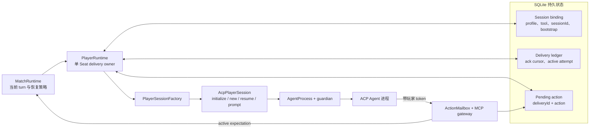
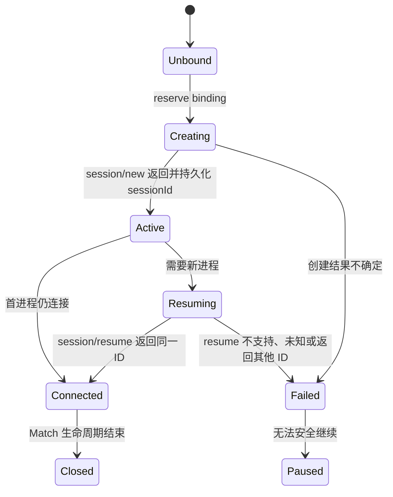
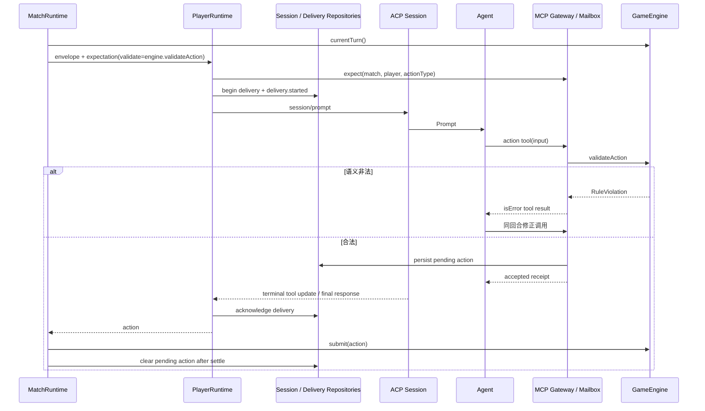
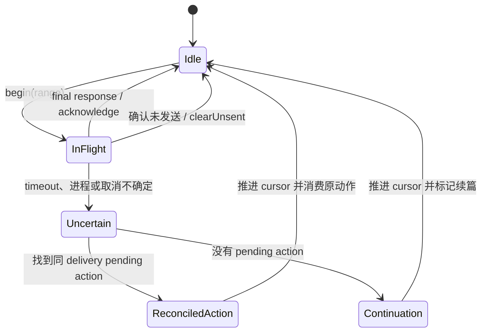

# ACP Session 运行时架构

本文描述 AgentWolf 如何为每个 Match Seat 建立一个持久逻辑 ACP Session，并在进程退出、Prompt
超时、工具调用和 server 重启之间保持上下文与动作恰好对账一次。目标读者是修改 ACP Provider、
玩家进程、Session binding、delivery、MCP action 或恢复逻辑的研发人员。游戏规则由 GameEngine
拥有，Match 级暂停/继续由 MatchRuntime 决定。

## 设计目标与边界

ACP Session 运行时遵守以下约束：

- 一个 Seat 在 Match 与赛后流程中只有一个逻辑 Session ID；
- Agent OS 进程与逻辑 Session 生命周期分离，进程可以重建，Session 必须精确 resume；
- 每次 Prompt 发送前持久化 delivery 范围，最终响应后才确认游标；
- 结构化动作在 MCP 成功回执前持久化，ACP response 丢失时仍可安全消费；
- 未确认的送达不通过重放完整历史或创建新 Session 掩盖；
- 只恢复受影响玩家，其他玩家的进程、Session、游标和 barrier 状态保持不动；
- 进程、Session、Prompt 和 Match 关闭均有有界终止路径。

[`packages/acp`](../../packages/acp/README.md) 拥有通用 ACP 协议、进程、Provider 启动策略和 delivery
ledger 原语；它不了解 phase、Role、Match repository 或恢复策略。`apps/server` 把这些原语绑定到
玩家身份、ActionMailbox、持久化和 GameEngine action expectation。

## 组件与生命周期边界

下图突出逻辑 Session、承载它的进程以及 Match 持久状态之间的分离。

| 组件                      | 拥有的状态或决策                                                                    | 不跨越的边界                                              |
| ------------------------- | ----------------------------------------------------------------------------------- | --------------------------------------------------------- |
| `MatchRuntime`            | 当前 TurnDescriptor、并发 actor 集、自动恢复次数与 Match pause                      | 不创建 ACP Session ID，不篡改 delivery ledger             |
| `PlayerRuntime`           | 单玩家 Session 连接、delivery、pending action 对账、状态与 trajectory               | 不判断 phase/Role 规则，校验委托给 expectation/GameEngine |
| player-session repository | durable profile/tool snapshot、binding state、Session ID、bootstrap、pending action | 不启动进程，不解释 ACP response                           |
| `DeliveryLedger`          | `acknowledgedSequence` 与最多一个 active attempt                                    | 不保存 Prompt 文本或游戏动作                              |
| `ActionMailbox`           | token 绑定、当前 expectation、内存 action handoff                                   | 不成为持久动作所有者；接受回调立即写 repository           |
| `AcpPlayerSession`        | ACP 连接、协议协商、逻辑 Session 操作、单个 active Prompt                           | 不决定 Match 恢复或替换 Session                           |
| `AgentProcess`            | 子进程组、stderr tail 与 TERM/KILL 关闭                                             | 不理解协议消息或游戏状态                                  |

## Session 建立与配置

PlayerRuntime 启动前先读取 `(matchId, playerId)` binding。binding 保存创建时选择的 Profile 与 Tool，
因此后续目录编辑不会改变该 Seat 的 Agent 配置。

没有 binding 的新 Match 先以 `creating` 状态 reserve，再启动 ACP 进程并调用一次 `session/new`；
拿到 Session ID 后才将 binding 原子更新为 `active`。若 binding 已处于 creating 或缺少 Session ID，
运行时拒绝再次调用 `session/new`，因为第一次创建结果可能已经存在于 Provider。

已有 active binding 时，PlayerRuntime 只用持久 Session ID 调用 `session/resume`。返回 ID 必须逐字
一致；Provider 必须在 initialize capabilities 中声明 resume。`session/new` 的唯一通用调用点位于
ACP package，server 只能通过 factory 请求“创建”或“恢复给定 ID”。

`AcpPlayerSession.start` 的装配顺序为：

1. 根据 Tool 与玩家隔离策略生成 command、args、environment 和 workspace；
2. 通过 guardian 启动 stdio 进程，建立 NDJSON ACP connection；
3. 协商精确协议版本并检查 `session.resume` capability；
4. 调用 `session/new` 或 `session/resume`，同时传入玩家绑定 MCP server；
5. 从 Agent 宣告的 config options 中设置 Profile model、可选 reasoning effort 和 mode；
6. 只允许声明的知识工具与 AgentWolf action tools 通过 permission request。

省略 reasoning 时保留 Provider 默认；显式 model/reasoning/mode 必须出现在 Provider 宣告的选项中，
无法兑现配置的 Session 在接收 foundation 前失败。

## Bootstrap 与普通回合

Session 建立后，PlayerRuntime 根据 binding `bootstrapState` 决定是否发送 foundation：

- `pending`：渲染 foundation，将状态写为 `dispatched` 后发送；
- `dispatched`：恢复同一 Session，发送紧凑 bootstrap continuation；
- `acknowledged`：直接从当前 delivery cursor 继续普通回合。

普通回合同时连接 Prompt 送达和 action expectation：

ActionMailbox 通过随机 token 将 MCP 请求绑定到唯一 Match/Player，并只在该玩家有 active expectation
时接受指定 action type。interrupt skill 仅在 expectation 声明的 interrupt abilities 中可用。
`expectation.validate` 在 mailbox 写入动作前调用 GameEngine，因此 schema 或规则错误以 MCP 失败结果
返回，Agent 可以在同一个 ACP 回合内修正。

合法动作触发 `onAccepted`：trajectory 记录 action，session repository 以当前 delivery ID 保存
pending action，然后才返回成功 tool receipt。PlayerRuntime 观察 terminal tool update 后可以取消
仍在生成的 ACP Prompt，并把“动作已经接受”视为正常 `end_turn`，避免等待无意义的后续文本。

### 直接发言

speech turn 可以使用结构化 `submit_speech`，也可以把最终自然语言 response 直接提交。直接发言
采集器区分 agent message、reasoning、知识工具输出、action tool 边界和角色标签：知识查询可以发生
在发言开始前，一旦公开文本开始，后续工具内容不会混入公开 stream。

干净文本分块实时发送给 LiveHub，最终 response 形成规范 speech action。GameEngine 在提交时处理
Player ID 引用和 speech sanitization；未知 `player-N` 引用导致回合失败并允许修正。结构化 action
流量与自然发言不会共享同一公开文本通道。

## Delivery 台账与提交语义

每个玩家只有一份 `DeliveryLedger`。`begin` 使用当前确认游标生成
`fromSequence=acknowledged+1` 和 envelope `toSequence`，并在 `session/prompt` 前持久化为
in-flight。另一个 delivery 在 active attempt 解决前不能开始。

确认游标表示“该事件范围已经交给逻辑 Session 处理”，不等同于动作已经进入 GameEngine。pending
action 单独证明动作已经被 action gateway 接受。两者分离使恢复可以明确判断：

- delivery 完成：确认 cursor，清除 active attempt；
- Prompt 失败但同 delivery 已有 pending action：确认/对账 cursor，返回持久动作，不重新 Prompt；
- delivery 不确定且没有 pending action：将范围标为 uncertain 后对账推进 cursor，并设置
  `continuationPending`；下一次只发送当前阶段续篇；
- in-flight 请求明确没有发送：可以清除 attempt，cursor 保持不变。

delivery.started/acknowledged 同时写入 god-visible 领域事件，用于将 Prompt range 与 trajectory 审计
关联；完整 ledger snapshot 位于独立 repository。

## 恢复与重启

当 Session 断开时，PlayerRuntime 关闭残留连接，在同一 workspace 以 binding Session ID 启动新
进程并调用 resume。恢复返回后先对账 active delivery，再把状态置为 ready。`MatchRuntime` 为每个
`playerId:phaseId` 提供一次自动恢复尝试，并只并发处理处于 failed 的玩家。

对账后的执行分支为：

1. 有 pending action：`takeTurn` 先验证其仍匹配当前 expectation，直接返回给 MatchRuntime；
2. 无 pending action：重新渲染当前 TurnDescriptor，使用 continuation Prompt；
3. binding 缺失、resume capability 缺失、Provider 拒绝 ID、返回 ID 不同或再次失败：MatchRuntime
   追加 `match.paused` 并持久化 paused reason。

server 启动时 repository 将未完成 Match 标记为 paused。操作者 resume 后，MatchManager 从 board
snapshot 与事件日志恢复 GameEngine，创建 PlayerRuntime，读取原 bindings 与 ledgers，恢复全部原始
Session，并继续当前 action boundary。其他玩家不会收到 foundation 或完整历史重放。

赛后评分与感想继续使用相同 PlayerRuntime/Session。赛后 coordinator 以独立的 postgame turn record
记录尝试、uncertain failure 和完成状态；它不推进游戏 delivery cursor，也不把赛后内容写入领域
事件日志。

## 进程监管与关闭

在 macOS/Linux 上，`AgentProcess` 通过 `process-guardian.sh` 启动独立进程组。guardian 中继 stdio、
观察 AgentWolf 父进程，并在父进程消失时终止整棵后代树。Windows 直接持有子进程。

关闭顺序为：

1. ACP Session 尝试有界 `session/close`；
2. connection 关闭；
3. 进程组发送 TERM；
4. grace period 后仍未退出则发送 KILL；
5. MatchRuntime 撤销玩家 MCP token 并清理内存 mailbox expectation。

stderr 只保留有界 tail，并写入当前 trajectory diagnostic；它不进入公开 MatchView。

## 状态、故障与可观测性

| 可观察状态                                                     | 来源                      | 用途                              |
| -------------------------------------------------------------- | ------------------------- | --------------------------------- |
| `idle/starting/ready/syncing/thinking/submitted/failed/closed` | PlayerRuntime             | server projection 与运维判断      |
| binding state、Session ID、generation、bootstrap               | player-session repository | 精确恢复与防止重复创建            |
| acknowledged cursor、active attempt                            | delivery repository       | 上下文增量与不确定送达对账        |
| pending action                                                 | player-session repository | 工具成功后的持久提交证明          |
| ACP updates、usage、permission、stderr                         | trajectory                | 逐回合诊断与语义审计              |
| delivery events、match.paused                                  | 领域事件                  | 将外部传输边界关联到 Match 时间线 |

协议版本不匹配、请求的 config/mode 不可用、并发 Prompt、Session close timeout、非法 permission、
Prompt timeout 或 cancel 未确认都会以显式 lifecycle/delivery error 上抛。ACP package 只报告连接是否
仍可复用；server 根据 binding、ledger、pending action 和当前 phase 决定恢复或暂停。

## 扩展边界与不变量

- 新 Provider 只扩展 Tool catalog、launch policy 和 factory 适配，必须保持相同 Session、Prompt、
  permission、stream 和 close 契约。
- Match 级重试、pending action、cursor 与 pause 策略留在 server，不能下沉到 Provider adapter。
- `session/new` 只服务没有 binding 的首次创建；任何恢复都使用持久 Session ID。
- 一个 PlayerRuntime 同时最多有一个 active Prompt 和一个 active delivery。
- 成功 MCP 回执之前必须保存 pending action；GameEngine settle 之后才清除。
- 语义非法工具调用不改变 Match、delivery 或 barrier，并允许同回合自我修正。
- 进程重建不等于 Session 重建，恢复不能更换 Session ID 或重放完整历史。
- Player workspace、token 和 permission 只属于一个 Match/Player，不能跨 Seat 共享。

## 深入阅读

- [系统架构](../architecture.md)：ACP 在端到端 Match 中的位置。
- [Prompt 与玩家上下文](prompt-and-context.md)：foundation、增量 turn、续篇和玩家环境。
- [信息同步](information-synchronization.md)：并行 barrier、发言分块与播报门控。
- [Match 生命周期](match-lifecycle.md)：运行时恢复、删除和赛后 Session 生命周期。
- [ACP package](../../packages/acp/README.md)：通用协议与进程失败边界。
- [Server package](../../apps/server/README.md)：PlayerRuntime、repositories 与 ActionMailbox 所有权。
