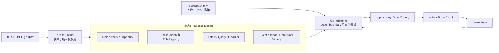
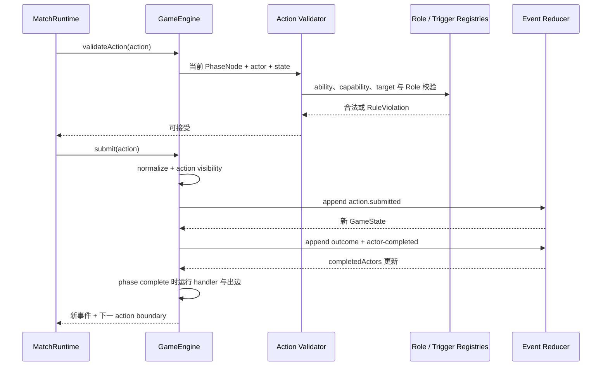

# 游戏运行时架构

本文描述 AgentWolf 如何把冻结的 board、版本化 Ruleset 与玩家动作转换为可确定重放的事件流。
目标读者是修改规则插件、phase 图、动作校验、effect 结算、胜负或 replay 的研发人员。Agent 回合
编排、Prompt 呈现、持久化和浏览器投影位于运行时之外。

## 设计目标与边界

游戏运行时需要同时保证：

- 相同冻结配置、稳定 seed/clock 和动作顺序得到相同事件语义、状态和胜负；
- 具体 Role 与规则变体通过插件组合，通用内核保持语义中立；
- 每次状态变化都能由事件解释并重建；
- 动作在改变状态前完成 actor、phase、能力、目标和次数校验；
- 多个能力通过统一 effect 管线结算，不在中央代码中建立 Role 分支；
- 事件携带可见性，但 IO 层负责针对实际观看者进行最终过滤。

[`packages/game-engine`](../../packages/game-engine/README.md) 只依赖 contracts 与 Zod。它不读取
文件、数据库或网络，不启动 Agent，不渲染 Prompt，不认识 Profile、Character、Session 或 Web
组件。server 选择 Ruleset、提供动作、保存事件并处理外部生命周期。

## 运行时组件

下图显示 Ruleset 组合、GameEngine 控制循环与事件归约之间的关系。registries 是插件向内核贡献
行为的稳定接口；事件日志是 GameState 的唯一变化来源。

| 组件                  | 拥有的决策或状态                                                                                                                     | 输入与产出                                                |
| --------------------- | ------------------------------------------------------------------------------------------------------------------------------------ | --------------------------------------------------------- |
| `RulesetBuilder`      | plugin 安装顺序、依赖、配置 schema 与语义所有权                                                                                      | RulePlugin 列表 → 冻结 `RulesetRuntime`                   |
| registries            | Role/Ability、actor selector、action validator、phase handler、effect、query、trigger、interrupt、plugin event 与 victory 的唯一注册 | plugin 贡献 → 可按契约查询的行为集合                      |
| `PhaseGraphRegistry`  | phase 节点、循环入口和有序插入，保证返回边、引用与可达性有效                                                                         | plugin nodes/insertions → `PhaseGraph`                    |
| `GameEngine`          | 当前 action boundary、事件序列与派生 GameState                                                                                       | board、Ruleset、动作 → 新事件与下一 `TurnDescriptor`      |
| action validator      | 当前 actor、动作类型、能力、目标、基数、使用次数与 Role 自定义规则                                                                   | `PhaseNode` + GameState + action → 接受或 `RuleViolation` |
| `ResolutionRegistry`  | effect lane、同 lane 顺序、动态入队与 finalizer 合并                                                                                 | abilities 产生的 effects → `ResolutionResult`             |
| plugin event registry | typed plugin state 的 schema 与 reducer                                                                                              | `plugin.event` → plugin state 分片                        |
| victory registry      | 基础 evaluator 的一致性、有序 modifier 与明确获胜 Player IDs                                                                         | 终局上下文 → 唯一 victory candidate                       |
| event reducer         | 从领域事件重建所有核心与 plugin 状态                                                                                                 | 旧 GameState + GameEvent → 新 GameState                   |

## Ruleset 组合与锁定

每个 `RulePlugin` 声明 ID、版本、可选依赖和可选配置。安装器先验证重复 ID、依赖版本、依赖环和
配置 schema，再按拓扑顺序进入 plugin install scope。注册期间产生的 Role、Ability、Phase、
plugin event、query 与 trigger 会记录到该 plugin 的 semantic contribution；跨 plugin 冒领或重复
注册在构建时失败。

`RulesetRuntime` 冻结以下协作面：

- Role/Ability/capability registry；
- actor selectors、predicates 与 phase completion handlers；
- phase graph；
- resolution effects 与 finalizers；
- query definitions/modifiers；
- decision triggers 与 interrupts；
- plugin event reducers；
- victory evaluators；
- 有序 plugin 元数据和 semantic contributions。

server 的 Ruleset catalog 为 Match snapshot 生成 lock：Ruleset ID/版本、有序 plugin ID/版本、
规范化配置哈希和整体 fingerprint。恢复既有 snapshot 时，catalog 解析其 Ruleset 并比较 fingerprint；
不匹配会在建立运行时前失败。board 的 phase 图始终来自锁定的 Ruleset runtime，目录中的可变定义
不能改变已经创建的 Match。

## Phase 图与 action boundary

`PhaseNode` 把控制流和动作契约放在一起。一个节点声明：

- `automatic`、`parallel` 或 `sequential` 模式；
- action 类型、可见性、允许的 ability/capability 或 Sheriff action；
- actor selector 和可选 active predicate；
- public、actors 或 god 的阶段呈现；
- 可选 interrupts；
- 带 predicate 的有序出边和 fallback 出边。

Ruleset 构建时验证入口、边目标、插入关系和可达性。运行时进入节点时先跳过 active predicate 为
假的节点，并为交互节点通过 selector 冻结 actor 集。`GameEngine.#drive` 连续执行 automatic 节点，
直到交互 action boundary、终局或无出边；循环有明确上限，错误图不会无限推进。

`currentTurn` 从当前节点直接导出 `TurnDescriptor`，包括 actors、动作类型、允许 abilities、动态
decision-trigger abilities、pass 许可和 interrupts。包裹循环入口的 phase insertion 同时重写返回旧入口
的边，使首夜阶段与后续夜晚共享一条循环边界。server 不需要根据 phase ID 猜测动作语义。

Phase interrupt 的资格独立于主 action actor 集。引擎按当前节点声明的 interrupt capabilities 查询
任意存活玩家的合法 ability；普通 action 仍受冻结 actors 与 sequential 首 actor 约束。server 可以
据此并行开放后台 listener,但只有通过同一 action gateway 的 interrupt 才能改变规则状态。

## 动作提交与阶段推进

下图说明一个动作如何从未可信输入变成事件，并在 phase 完成后继续控制流。

校验按以下层次进行：

1. Match 必须处于 running；普通 action actor 必须属于当前冻结 actor 集且尚未完成，interrupt actor
   必须存活并拥有节点声明的 capability；
2. sequential 节点只接受当前首个 actor；
3. action type 与 `PhaseNode.action` 对齐；
4. ability/capability、目标 IDs、目标数量、pass 语义和次数限制通过 Role registry 校验；
5. plugin 注册的有序 action validators 对关系或规则组合贡献额外纯校验；
6. decision trigger 或 interrupt 还需通过其声明的 signal、context 与 handler 契约。

拒绝动作不追加事件、不改变 `completedActors`、不推进 phase。接受动作先规范化并发出
`action.submitted`，随后把动作的稳定结果表示成更多事件，最后发出 god-visible 的
`phase.actor-completed`。sequential 节点宣布下一位 speech actor；parallel 节点只在所有 actor
完成后进入 completion handler。server 可以对顺序发言使用 deferred continuation，在外部播报边界
释放后再调用 `continueAfterDeferredAction`，但 phase 语义仍由引擎持有。

## Ability 与 effect 结算

Role registry 将 Ability 定义与其 Role、允许 action types、校验、effects 和 outcomes 关联。
capability 允许多个 Role 共享同一机制，也允许插件动态授予或撤销能力，而无需复制机制或把 Role
身份写入内核。

effect 结算分为“产生意图”和“归并结果”两步：

```mermaid
flowchart LR
    Actions["已校验 actions"] --> Abilities["Ability.effects"]
    Abilities --> Queue["ResolutionAgenda"]
    Queue --> Targeting["targeting"]
    Targeting --> Prevention["prevention"]
    Prevention --> Protection["protection"]
    Protection --> Damage["damage"]
    Damage --> Information["information"]
    Information --> Death["death"]
    Death --> Reaction["reaction"]
    Reaction --> Announcement["announcement"]
    Announcement --> Victory["victory"]
    Victory --> Finalizers["ordered finalizers"]
    Finalizers --> Result["deaths、saved、inspections、usage"]
```

每个 effect kind 有 schema、lane 和可选的同 lane `before/after` 约束。registry 对定义做拓扑排序，
再按 lane、定义顺序和入队顺序执行；handler 可以向同一 frame 追加 effects。队列和 phase drive 都有
有界步数，未知 effect、跨 lane 排序或依赖环会失败。finalizers 按稳定顺序读取 frame facts，将死亡、
营救、查验和 ability 消耗等贡献合并成 `ResolutionResult`。

Ability outcomes 再把结算结果转换为带 visibility 的领域事件。自动死亡 trigger 在一个有界批次中
展开并去重连锁死亡，继承原死亡的昼夜时点；随后才开放交互式死亡 trigger/interrupt。基础胜负
evaluator 产生候选，有序 modifier 可以依据 plugin state 补充、阻断或替换候选，最终返回明确获胜
Player IDs。终局 phase 同样执行有序 handlers，使 Role plugin 可以在通用终局事实与身份公开完成后
追加自身拥有的公开揭晓事件。

## 事件、状态与 replay

`GameEngine` 通过唯一 append 函数生成事件：分配 Match 内递增 sequence、时间、visibility 和 payload，
验证 plugin event schema，然后立即调用 reducer。核心 reducer 负责 Match、phase、玩家、Sheriff、
死亡、投票、能力、capability 和终局状态；plugin event registry 负责各插件的 `pluginState` 分片。

事件可见性有 public、god、players 和 faction 四类。死亡事实记录原因与昼夜时点，终局事实记录
Faction 与明确获胜 Player IDs。引擎决定事件事实和初始可见性；server 结合观看者
身份、公开淘汰、Role reveal 和 phase presentation 构造最终视图。精确投影规则属于
[信息同步架构](information-synchronization.md)。

恢复和 replay 从空状态开始顺序归约事件，并使用 snapshot 锁定的 Ruleset 解释 plugin events。
GameEngine restore 只额外应用持久 Match status 与 paused reason；它不读取当前目录、trajectory 或
浏览器状态。会影响重放的随机选择在 Match 初始化或规则执行时被确定并以事件/稳定算法固定。

## 扩展边界

- 新 Role 通过 Role plugin 注册 Role、abilities、capabilities、专属 phases、events、effects、queries、
  action validators、triggers、interrupts 或 victory modifier；跨层实现使用
  [Role 开发 Skill](../../.agents/skills/agentwolf-role-development/SKILL.md)。
- 新共享机制进入最窄 registry；只在多个插件需要同一契约时扩展通用类型。
- 新 phase 行为通过节点声明、selector、predicate 和 handler 表达，server 与 action validator 不添加
  phase ID 推断。
- 新持久 Role 状态必须由 plugin event schema/reducer 重建；进程内缓存不能成为规则事实。
- 新结果呈现通过事件与 visibility 进入 Prompt/projector 资产，不把文案、动画或 Character 语义写入
  engine。

## 故障与验证边界

- plugin 版本、依赖、配置、语义所有权或 phase 图非法时，Ruleset 构建失败。
- snapshot fingerprint 不匹配时，server 拒绝恢复该 Match。
- 输入 schema、actor、phase、ability 或目标非法时，动作在任何事件产生前失败。
- 未知 effect、effect 顺序环、队列超限、phase drive 超限或冲突 victory candidates 作为规则错误上抛，
  MatchRuntime 在应用边界暂停 Match。
- 单元与 property 测试覆盖 registry、phase、动作、结算、visibility、胜负和 replay；跨层 Session、
  Prompt、持久化与浏览器行为由相应模块测试负责。

## 架构不变量

- GameState 的规则变化只来自已校验并按序追加的 GameEvent。
- 通用内核不包含具体 Role、Ability、Phase 或 Plugin ID 分支。
- PhaseNode 是 actor、action、visibility、interrupt 和控制流的语义来源。
- 自动死亡反应先形成完整死亡批次，交互式死亡技能与胜负只读取该稳定结果。
- Ability 产生 effects，ResolutionRegistry 结算共享交互，Role plugin 产生其 outcomes。
- Ruleset lock 和 fingerprint 决定 replay 解释器，目录当前值不能改写既有 Match。
- 引擎只声明 visibility；server projection 才是外部消费者的保密边界。
- Ruleset、board、事件和动作顺序相同时，replay 到达相同状态和终局。

## 深入阅读

- [系统架构](../architecture.md)：跨包依赖与端到端 Match 链路。
- [Prompt 与玩家上下文](prompt-and-context.md)：plugin semantic contribution 如何约束 Prompt bundle。
- [信息同步](information-synchronization.md)：event/phase visibility、barrier 与外部投影。
- [Match 生命周期](match-lifecycle.md)：Ruleset snapshot、事件持久化和恢复。
- [游戏规则基线](../reference/game-rules.md)：当前 board 政策与规则定义。
- [游戏目录](../generated/game-catalog.md)：由源码生成的 Roles、boards 与 Prompt 清单。
