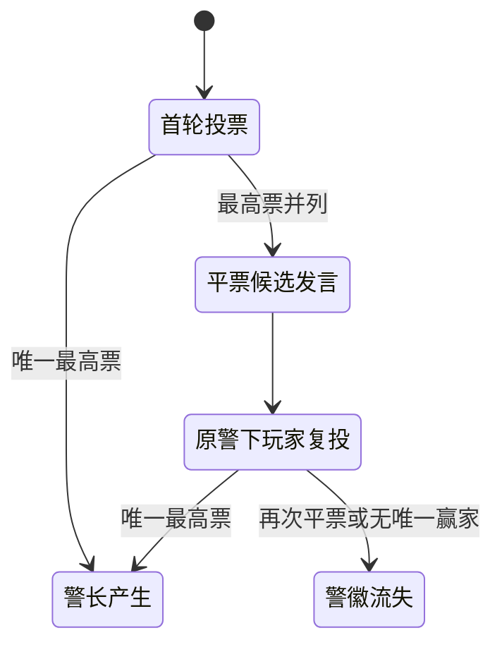
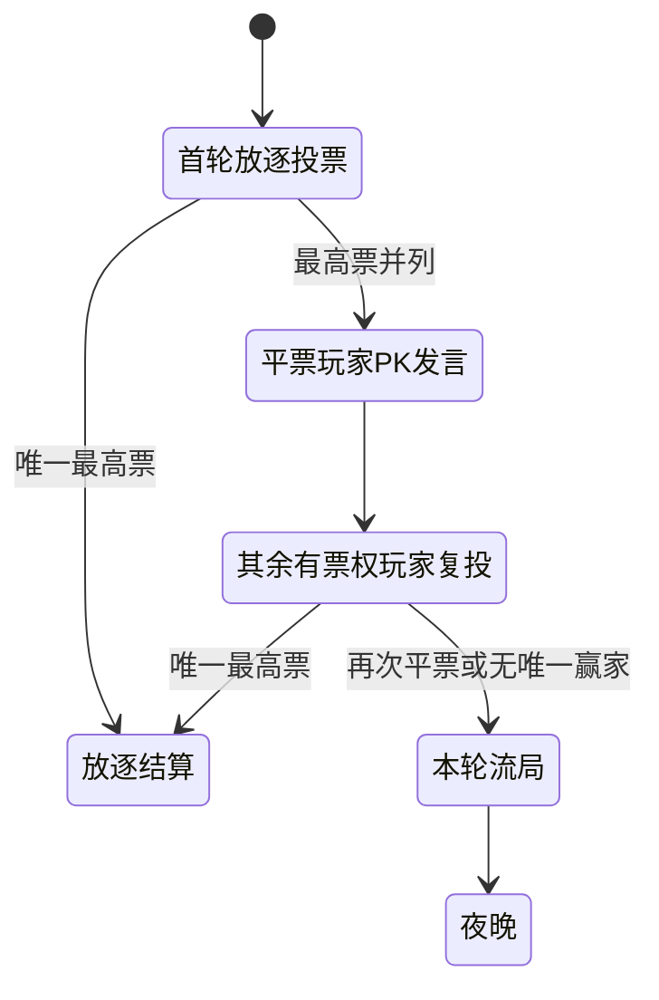
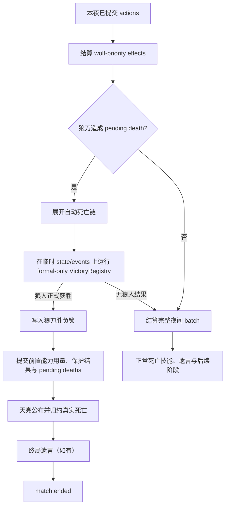
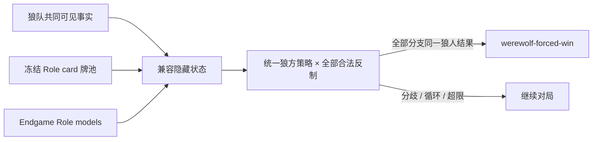

# 游戏结算与终局

本文描述 AgentWolf 当前的投票结算、死亡批次、正式胜负、狼刀优先检查点、狼人必胜证明与终局事件。
目标读者是修改 Ruleset、Role、Ability、死亡反应、胜负条件或 phase 图的研发人员。动作与 effect 的
通用执行模型由[游戏运行时](game-runtime.md)拥有；终局投影与持久化分别由
[信息同步](information-synchronization.md)和[Match 生命周期](match-lifecycle.md)拥有。

## 目标与边界

结算必须同时满足以下约束：

- 正式胜负只读取冻结 board、当前 Ruleset、事件归约后的 `GameState` 与 Role plugin state；
- 警长与放逐投票都完整区分首轮、平票复投和第二次平票结果；
- 夜间在狼刀死亡及其自动死亡链后设置正式胜负检查点，后序效果不能逆转已经成立的狼人胜利；
- 狼人提前结算只使用狼队实际可见事实，并对全部兼容隐藏状态和全部合法反制成立；
- 无法证明必胜时继续对局，求解超限、未知能力或状态分歧都不能变成乐观判胜；
- `match.ended` 固定 winner、reason 与 `winningPlayerIds`，下游不得重新推断赢家；
- 相同 Ruleset、board、事件和动作产生相同终局，restore 与 simulation 不读取进程外状态。

game-engine 拥有纯规则计算和终局顺序。server 负责持久化事件、停止普通 Agent 回合、构造投影并
进入 postgame。玩家 system prompt 接收同一套平票和狼刀优先规则摘要；浏览器与 Agent 都不参与
胜负求值。

## 结算组件与状态所有权

| 组件或状态                      | 所有者                | 职责                                                         |
| ------------------------------- | --------------------- | ------------------------------------------------------------ |
| `BoardManifest.policies`        | board snapshot        | 冻结屠边/屠城、Witch、Guard、遗言等变体                      |
| 投票 phase 图与 `vote.resolved` | Sheriff / Day plugins | 管理首轮、PK 发言、复投、警徽流失与无人放逐                  |
| `ResolutionRegistry`            | Ruleset               | 按 effect lane 结算目标映射、保护、伤害与信息                |
| `TriggerRegistry`               | Ruleset               | 展开自动死亡链，并在稳定死亡后提供交互式死亡技能             |
| `VictoryRegistry`               | Ruleset               | 先运行正式 evaluators/modifiers，再运行狼人 forced evaluator |
| 狼刀胜负锁                      | Victory plugin state  | 固定狼刀检查点得到的狼人候选，供后续 phase 与 replay 复用    |
| `EndgameRegistry`               | Role plugins          | 校验 Role 模型、物质/信息能力覆盖与控制组可见观察            |
| `match.ended`                   | terminal phase        | 固定终局三元组并启动最终身份揭示                             |
| foundation system prompt        | Prompt runtime        | 向每位玩家注入当前平票与狼刀在先规则                         |

`winner` 是呈现用 Faction 标签，`winningPlayerIds` 是完整获胜集合，`reason` 标识生效的正式条件、
狼刀检查点或提前证明。三者一起写入 append-only 事件，postgame 与 archive 只消费该事件。

## 正式胜负

### 基础条件

经典基础 evaluator 产生以下正式候选：

| board 政策       | 条件                                          | winner     | reason                          |
| ---------------- | --------------------------------------------- | ---------- | ------------------------------- |
| 所有 board       | 存活 Werewolf Faction 玩家为零                | `village`  | `all-werewolves-eliminated`     |
| `slaughter-all`  | 存活非 Werewolf Faction 玩家为零              | `werewolf` | `all-non-werewolves-eliminated` |
| `slaughter-edge` | 存活 `kind = villager` 玩家为零               | `werewolf` | `all-villagers-eliminated`      |
| `slaughter-edge` | 存活 Village Faction 且 `kind = god` 玩家为零 | `werewolf` | `all-gods-eliminated`           |

Village 或 Werewolf 的基础获胜集合包含该 Faction 的全部玩家，不要求终局时仍然存活。Thief 等
Role 转换先通过事件改写当前 Role 与 Faction，再参与正式结算。

### Role modifier

`VictoryRegistry` 在基础 evaluator 后按稳定 order 执行 modifiers。Cupid modifier 负责人人恋、狼狼恋
共享阵营胜负，以及人狼恋第三方对普通候选的阻断和独立胜利。多个基础 evaluator 只有在 winner、
reason 和规范化赢家 IDs 完全一致时才能并存；空赢家、重复赢家或冲突候选属于规则错误。

狼刀检查点也调用完整的 formal-only 入口，因此 Cupid 与未来 modifier 在锁定前已经生效。检查点
只接受 `winner = werewolf` 的候选，其他正式结果继续走完整夜间结算。

## 平票状态机

平票是投票阶段结果，不是整局胜负条件。`emitVoteResolution` 对每轮投票生成总票数、最高票玩家集合
和唯一选中玩家；最高票并列时 `selectedPlayerId = null`，phase 图决定是否进入复投或结束本轮。

### 警长竞选

复投资格仍是最初未上警的存活玩家，平票候选人只参加 PK 发言。第二轮没有唯一赢家时追加
`sheriff.badge-lost`，本局不产生警长。

### 白天放逐

放逐复投排除所有平票候选人。第二轮仍无唯一最高票时公开 `no-exile`，不淘汰任何玩家并进入夜晚。
狼人必胜求解器使用同一两轮语义：首轮同票进入复投，复投同票才进入无人放逐的夜间分支。

## 狼刀优先检查点

### Ability 阶段声明

加入夜间 batch 的 Ability 必须声明 `nightResolutionStage`：

| 阶段                 | 语义                                           | 当前示例                                        |
| -------------------- | ---------------------------------------------- | ----------------------------------------------- |
| `wolf-priority`      | 决定狼刀目标是否死亡，参与狼刀后的正式胜负检查 | 普通/觉醒狼刀、Guard 保护、Witch 解药、机械盾   |
| `post-wolf-priority` | 只在狼刀检查点没有锁定狼人胜利时执行           | Witch 毒药、复制毒药、Seer 与 Magic Mirror 查验 |

独立 phase 已经完成归约的 Ability 使用 `resolutionTiming = phase`，不进入该 batch 分类。所有
`nightAttack` Ability 必须属于 `wolf-priority`；Ruleset 构建会拒绝漏声明或错误声明。

### 检查流程

检查点使用与真实结算相同的保护、伤害、自动死亡 trigger、plugin event reducer 和正式胜负 registry。
它先在临时 state/events 中归约狼刀死亡与 Cupid 殉情等自动反应；只有完整结果仍是狼人正式获胜时
才写入锁。自动链杀死最后狼人、形成第三方结果或仍未满足屠边/屠城时都不会锁定。

锁定后只提交 `wolf-priority` actions 的能力用量与结果，并保存该批次的 pending deaths。毒药、查验
等后序 actions 不消耗资源，也不产生结果事件。天亮仍按正常公开规则落定死亡和自动反应；
`has-death-trigger` 在锁存在时关闭，因此 Hunter 等交互式死亡技能没有新的决策窗口。终局 reason 为
`werewolf-knife-priority`，赢家 IDs 使用检查点得到的完整正式候选。

该机制按 Ability 阶段、effect、trigger 和 formal candidate 组合，不按 Hunter、Witch 或具体板子
编写终局分支。新增 Role 通过声明自己的阶段和模型接入同一流程。

## 狼人必胜提前结算

### 运行前提

正式胜负与狼刀检查点均未产生结果时，`VictoryRegistry` 才运行狼人 forced evaluator。证明还要求：

- Match 为 running，且没有尚未公布的 pending deaths；
- 当前 phase 能映射到明确的白天投票或夜间物质窗口；
- 启用 Sheriff 的首日 board 已完成警徽产生或流失；
- 狼方存在可独立控制且胜利目标稳定的控制组。

Village、Cupid 第三方及其他阵营只使用正式胜负条件。它们的票权、能力和目标仍作为狼人证明的
对抗分支。

### 控制组与可见信息

普通狼队从狼阵营名册获得共享成员。只有存活、共享阵营知识且在全部兼容 belief 中保持狼人目标的
成员属于同一控制组。Awakened Hidden Wolf 不共享普通狼队名册，只在自身已知攻击能力可用时形成
单人控制组。普通狼队与该单人控制组分别求解，任一组都不能使用另一组的身份知识、私密行动或
协作能力。

求解器只读取 public 事件、控制组成员获授权的 players/faction 事件、自身 Role、公开 Role reveal、
Idiot 翻牌和控制组可见的 Role 转换。Role plugin 可以把获授权的私有事件贡献为带 observer、目标
Player ID、Role 与事件序号的身份观察；Registry 验证 observer 属于当前控制组，且该成员确实可以
看到来源事件。玩家发言中的身份声称不收窄 belief。未知 Role、Potion 余量、情侣关系、Thief
底牌和动态能力从冻结牌池展开为全部兼容状态。

Awakened Hidden Wolf 的一次学习结果只收窄其单人 belief。学习 Magic Mirror Girl 只授予复制能力，
不会使其看到原 Magic Mirror Girl 的查验；由 Awakened Hidden Wolf 自己执行的复制查验结果才作为
该单人控制组的新观察。即使观察确认某名玩家是普通 Werewolf，知识仍是单向的，不会把两个控制组
合并。

Cupid 与 Thief plugin 可以收紧或拒绝 proof preparation。关系不可见、存活人狼恋会改变狼队目标、
Thief 选择不可见、隔离狼控制关系不确定或最终赢家 IDs 可能不同，都会返回无证明。

### 对抗搜索

每个 belief 由一组兼容世界组成。世界保留每名存活玩家的 Player ID、可能 Role、票权、Sheriff
归属、下一物质窗口和 Role 模型声明的资源。白天严格执行首轮投票与 PK 复投；夜间先处理狼刀
保护，再检查狼刀是否已经达到正式屠边/屠城，只有尚未达到时才把毒药和 Hunter 开枪作为反制继续
搜索。Guard 的连续目标限制、Witch 每夜用药、Idiot 放逐免疫与 Sheriff 票权都进入状态转换。

狼方在一个 belief 中必须选择对全部兼容世界都合法的同一个 Player ID。其他玩家的合法选择按最
不利联合反制处理；公开死亡、翻牌、票权或 Sheriff 结果把后继世界按控制组可见观察重新分区，后续
策略只能依据该观察调整。状态规范化、memoization 和 50,000 belief-node 上限保证确定性。循环、
多个当前模型无法分类的资源、未知 material 行为、候选冲突或节点超限都返回无证明，对局继续。

## 终局顺序

普通死亡批次采用以下顺序：

1. 合并直接死亡并展开不可选择的自动死亡链；
2. 提供仍合法的交互式死亡技能；
3. 已有赢家且死者具有遗言资格时完成终局遗言；
4. 进入 `phase-match-ended`；
5. 未终局时才处理 Sheriff 转移、普通遗言和下一阶段。

狼刀胜负锁存在时，第 2 步没有交互式死亡技能资格；自动死亡链已包含在锁定依据中。天亮死亡公布
和终局遗言仍然完成，随后直接进入 `phase-match-ended`，不会创建 Sheriff 转移、下一夜、发言、
投票、Agent delivery 或 trajectory turn。

terminal phase 再次运行完整 `VictoryRegistry`。狼刀锁和 forced proof 都是事件/确定性状态可复现的
候选，因此复评得到同一结果。随后依次追加 public `match.ended`、最终 Role reveal、底牌 reveal 与
Role plugin 拥有的终局揭示事件。

## Role 扩展门禁

每个 Role 必须声明 `endgameModel: inert | plugin`，每个 Ability 必须声明
`endgameImpact: none | information | material`。每个 plugin endgame model 还必须声明
`knowledgeAbilityIds`；产生身份知识的 material Ability 同时出现在 material 与 knowledge 集合中。
加入夜间 batch 的 Ability 还必须声明 `nightResolutionStage`。以下情况在 Ruleset 构建时失败：

- plugin Role 缺少 endgame model；
- inert Role 声明 material Ability；
- model 的 material Ability IDs 与 Role 定义不一致；
- 狼人 Role 以 inert 模型声明 information Ability；
- plugin Role 的 information Ability 未进入 knowledge 集合；
- knowledge 集合重复、引用无效 Ability，或缺少观察器；
- model 引用未安装 Role；
- 夜间 batch Ability 缺少阶段；
- `nightAttack` 未处于 `wolf-priority`。

Role 模型只描述狼方证明所需的有限语义，例如控制关系、控制组可见身份观察、药物、保护、死亡
技能与放逐免疫。观察器必须从事件流产生知识，不能读取 God-only 当前 Role 后直接返回。新增 Role
需要用 differential 测试证明模型与真实 effect、trigger、event reducer、visibility 和 restore 行为
一致。具体流程由[Role 开发 Skill](../../.agents/skills/agentwolf-role-development/SKILL.md)拥有。

## Prompt、恢复与下游消费

Prompt foundation 在每位玩家的 system prompt 中注入警长/放逐平票规则和“本局采用狼刀在先规则”。
引擎检查点、effect 阶段和 trigger 顺序只属于技术实现，不进入玩家 Prompt。Role Prompt 只补充自身
能力，不能改写结算规则。

GameEngine restore 从事件日志重建 Role、资源、plugin state、狼刀胜负锁和终局状态。belief 与搜索
cache 不持久化；同一事件前缀再次评估会得到同一候选。postgame、MVP/SVP、投影和 archive 直接消费
持久化 `match.ended.winningPlayerIds`，不根据终局存活人数重算。

## 故障与可观测性

- 正式 evaluator 冲突、空赢家、重复赢家或非法锁替换属于规则错误；
- Role 模型、material coverage 或夜间阶段声明不完整使 Ruleset 无法构建；
- belief 分歧、循环和节点上限属于正常无证明，不暂停 Match；
- `match.ended.reason` 区分正式条件、`werewolf-knife-priority` 与 `werewolf-forced-win`；
- `event-wolf-knife-victory-locked` 只对 God 可见，用于 replay、simulation 与研发审计；
- server 收到终局后停止普通 Agent turns，并把生命周期交给 postgame repositories。

## 架构不变量

- 首轮平票进入 PK/复投，只有复投仍无唯一赢家才产生警徽流失或本轮流局；
- 保护与解药先修正狼刀，狼刀死亡及自动链先于狼刀正式胜负检查；
- 狼刀已经形成狼人正式胜利时，毒药与交互式死亡技能不能逆转终局；
- 正式胜负先于狼人必胜证明，只有狼人阵营产生 forced candidate；
- 狼方证明不读取其不可见的 Role、Potion、情侣或底牌；
- 普通狼队与隔离狼分别拥有 belief；私有观察不能跨控制组传播；
- 同一 belief 中的狼方动作以 Player ID 统一，不能按隐藏 Role 选择不同席位；
- 无证明等价于继续游戏，不能降级为人数或票数阈值；
- `winningPlayerIds` 是 postgame 与 archive 的唯一赢家来源；
- belief 与搜索 cache 不进入事件日志、Prompt、投影或持久化。

## 深入阅读

- [游戏运行时](game-runtime.md)：Ruleset、phase、action、effect、事件归约与 replay。
- [游戏规则基线](../reference/game-rules.md)：当前 board 冻结的玩法政策。
- [Prompt 与上下文](prompt-and-context.md)：foundation system prompt 与可见事实边界。
- [信息同步](information-synchronization.md)：终局事件可见性与浏览器同步。
- [Match 生命周期](match-lifecycle.md)：终局持久化、postgame 与 archive。
- [Game engine package](../../packages/game-engine/README.md)：包内 registries 与扩展契约。
- [Role 开发 Skill](../../.agents/skills/agentwolf-role-development/SKILL.md)：新增 Role 的实现门禁。
