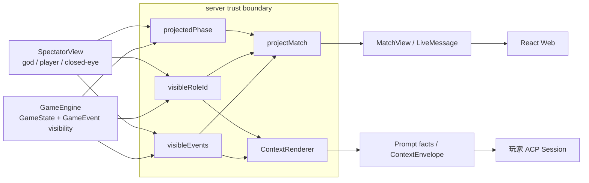
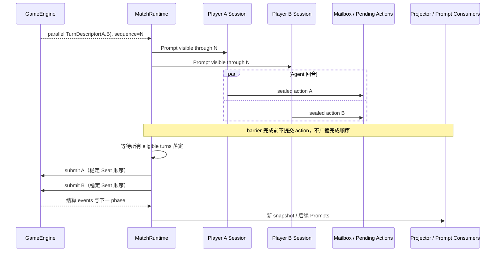
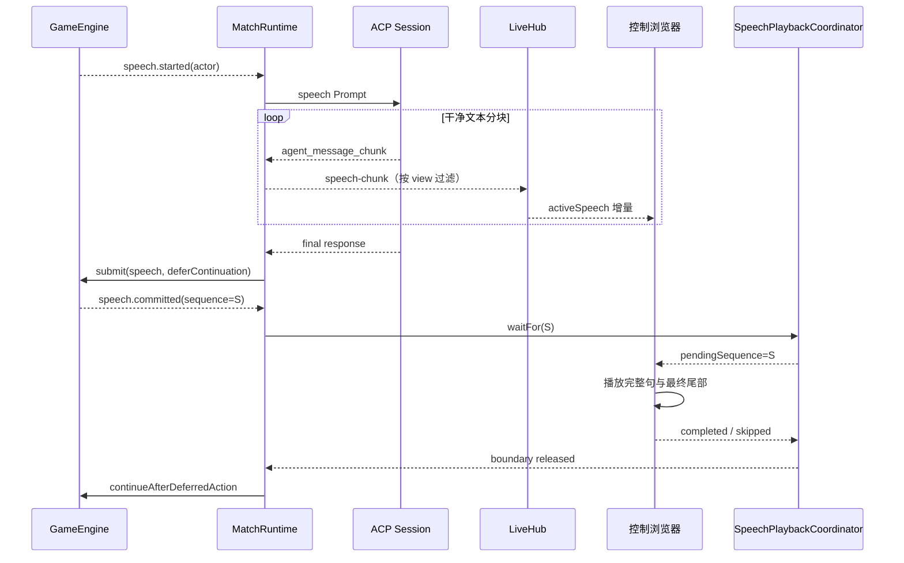
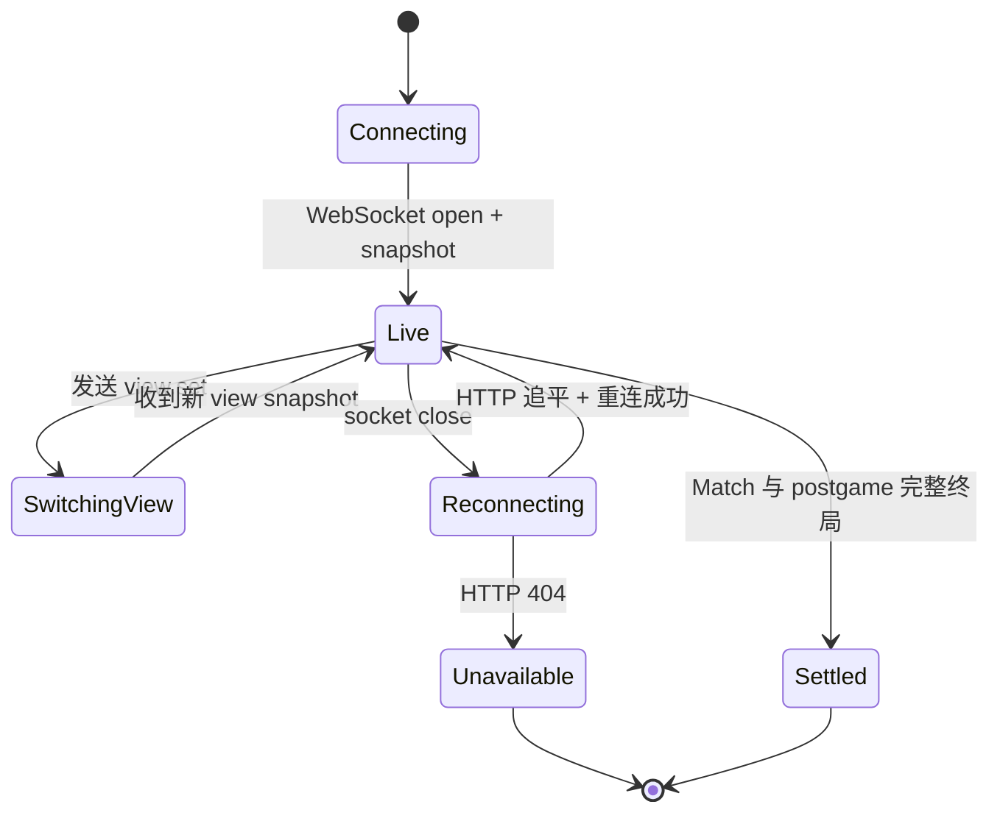

# 信息同步架构

本文描述 AgentWolf 如何在 GameEngine、多个 ACP Session、server projection 和浏览器之间同步事实，
同时保持隐藏信息、并行 barrier、发言顺序、语音播报和断线恢复语义。目标读者是修改事件可见性、
phase 投影、实时消息、并发动作、speech stream 或重连逻辑的研发人员。

## 设计目标与边界

信息同步需要保证：

- 每个玩家与观看者只收到其 view 授权的事件、Role、phase 和 Session 状态；
- 不可见 payload 和能够推断它的阶段/完成顺序都不能进入外部 DTO；
- 并行 actor 从同一事件边界决策，任何动作或响应时序在 barrier 完成前都不影响其他玩家 Prompt；
- 顺序发言立即成为后续玩家的公开上下文，并可以在浏览器流式呈现；
- 自动播报只在一个可见控制连接上门控 phase，断开、失败或跳过都能释放边界；
- server、Agent 或浏览器断线后从各自权威游标追平，不重放或重复应用已提交事实；
- 终局、赛后评分和感想以明确顺序进入首个可见快照。

GameEngine 拥有事件事实和初始 visibility；server 拥有观看者 projection、barrier 编排与实时连接；
Web 只消费 `MatchView` 和 `LiveMessage`。浏览器本地隐藏、CSS 或 React 条件不是保密机制。

## 从领域事件到消费者

隐藏信息沿两条投影路径到达模型和浏览器。两条路径都先过滤原始事件和 Role，再交给呈现层。

projector 不向浏览器发送“完整对象加隐藏标记”，而是从过滤后的事件和 Role 重新构造 DTO。Prompt
renderer 同样只接收 plain facts，不持有绕过过滤器的 GameState 查询接口。

## 可见性模型

`GameEvent.visibility` 有四种类型：

| visibility | 可见者                         | 典型用途                                   |
| ---------- | ------------------------------ | ------------------------------------------ |
| `public`   | god、所有 player、closed-eye   | 公告、公开 speech、公开 ballot、淘汰与终局 |
| `god`      | god                            | actor 集、delivery、完整私密动作与诊断事实 |
| `players`  | 指名玩家与 god                 | Role assignment、个人查验、非完整阵营共享  |
| `faction`  | 当前属于该阵营的 player 与 god | 阵营成员、阵营行动和共同知识               |

`canViewEvent` 只根据 event visibility、view 和当前玩家 Faction 判定。`visibleEvents` 再应用 Match 内
sequence cursor，保持事件原顺序。

### Role 可见性

`visibleRoleId` 按以下来源决定某 Seat 的 Role 是否可见：

- god 始终可见；
- Match ended 后全部 Role 可见；
- 公开 `role.revealed` 或显式公开身份事件可见；
- player 始终可见自己的 Role；
- player 只在已收到 `faction.members` 且双方属于该事件成员集时看见共享阵营成员 Role。

公开淘汰状态从 public announcements/events 派生。closed-eye 和普通 player 在 Match 运行中不会因为
GameState 已将玩家置死而提前看到私密死亡；projector 只在公开淘汰后改变外部 alive 状态。

玩家卡片标识同样只从已过滤事件派生。事件呈现可以贡献带语义 ID 的持久标识，projector 将其归入
对应 Seat 后再写入 `MatchView`。Match 运行期间，情侣标识来自私有连线事件，只有 god、Cupid 与
两名情侣的投影包含该标识；终局身份公开完成后，Cupid plugin 追加公开情侣揭晓公告，所有视角从
同一公开事件获得情侣标识。

### Phase 与 Session 状态

`PhaseNode.presentation` 可以是 public、actors 或 god。无权看到精确 phase 的 view 收到节点声明的
`hiddenPhaseId/hiddenLabelKey`，因此私密 actor 顺序和行为类型不会从页面标题泄露。

Session status 只向 god、该玩家本人或当前公开发言者暴露；其他 Seat 显示 idle。赛后完成/跳过后，
所有 Seat 统一显示 closed。projector 先过滤事件，再从过滤结果生成 timeline 和 Role effect cues，
所以私密事件无法通过动画、关联 Player ID 或文案侧漏。

## MatchView 投影

`projectMatch` 对每个 HTTP 请求或 WebSocket subscriber 独立执行，主要步骤为：

1. 使用 `visibleEvents` 取得该 view 的事件；
2. 选择精确或隐藏 phase；
3. 对每个 Seat 计算公开 alive/canVote、可见 Role、事件授权的玩家标识、公开 Character、Sheriff 与
   有限 Session status；
4. 只从过滤后事件建立 timeline、vote detail 与 semantic effect cues；
5. 从可见 `speech.started/committed` 恢复 active speech；
6. 加入 server-owned postgame view 与当前 reflection stream；
7. 终局投影保留获胜 Faction 与明确获胜 Player IDs，再用 `MatchViewSchema` 校验完整 DTO。

实时 snapshot 始终携带 subscriber 当前 `SpectatorView`。收到 `view.set` 后，server 先更新 subscriber
view，再重新投影 snapshot，并让 SpeechPlaybackCoordinator 检查当前 pending speech 是否仍可见。

## 并行 barrier

并行节点由 GameEngine 冻结 `phaseActors`。MatchRuntime 在提交任何动作前为所有未完成 actor 准备
Prompt；因为此时事件日志未变化，每个 envelope 拥有相同 `toSequence`。随后 ACP 回合可以并发完成，
但动作只进入各自 mailbox/pending-action 存储。

god view 与提交玩家自己的 view 可以通过有限 Session status 观察本方回合；其他玩家和 closed-eye
view 收不到 actor completion 或响应时长。GameEngine 的 `phase.actor-completed` 为 god-visible，
barrier 对外只在全部动作按稳定顺序提交后发布结果。

投票使用同一 barrier。进入 vote phase 前，前置 sequential speech phase 已经提交所有必需发言，
并且最后一个发言的外部播放边界已经释放，因此每位投票者的冻结 Prompt 包含相同的完整公开发言集。

## 顺序发言与实时 stream

sequential speech 节点一次只暴露一个 active actor。GameEngine 发出 `speech.started`，MatchRuntime
为该玩家发送 Prompt。ACP message chunks 经 direct-speech 过滤后直接进入 LiveHub；wolf council
分块只对 god 与当前 werewolf faction 可见，其他 speech/postgame chunks 为公开。

最终文本作为 speech action 提交，GameEngine 发出 `speech.committed`。MatchRuntime 对顺序发言使用
deferred continuation，使引擎停在已经提交但尚未进入下一 actor/phase 的稳定边界。

只有一个 WebSocket subscriber 可以拥有自动播放控制。若没有 owner、speech 对 owner 不可见或浏览器
未启用播放，`waitFor` 立即返回 `not-required`。控制者断开、切换到不可见 view、关闭播放、合成失败
或显式 skip 都以 skipped 释放当前边界，Match 不会因浏览器能力永久阻塞。

Web `useSpeechPlayback` 把流式文本切为完整句子，边生成边播放；`speech.committed` 到达时只补播尚未
消费的尾部，并把最终 sequence 绑定到整个 stream job。每个 barrier sequence 只回执一次。手动播放
只读取已提交 timeline，不拥有 server barrier，也不影响 phase。

## WebSocket、视图切换与重连

浏览器把 server snapshot 视为远端权威状态，把连接、播放、滚动和动效队列视为本地状态。

`useLiveMatch` 在瞬时断线期间保留最后有效 MatchView，通过 HTTP `getMatch` 追平，再以 250ms 起步、
最大 5s 的有界退避建立 WebSocket。404 表示 Match 不存在，进入 unavailable 且停止重试。Match ended
但 postgame 仍处于 countdown/collecting/speaking/paused 时保持 live；postgame completed/skipped 或无
postgame 时进入 settled。

视图切换期间 `loadedViewKey` 与请求 view 不同，页面标记 `viewPending`，旧 stage 设为 inert/隐藏，
直到新 snapshot 到达。RoleEffectController 同时把 baseline 重置到新投影 `lastSequence`，不会重播
旧 view 曾可见或新 view 追平的历史 cues。Speech hook 中断当前自动播放，并只在新投影仍含 pending
sequence 时恢复。

## 终局与赛后同步

GameEngine 先发出带明确获胜 Player IDs 的 public `match.ended`，再按稳定顺序发出最终 Role reveals
和 Role plugin 拥有的公开揭晓公告。MatchRuntime 在启用赛后复盘时暂缓首个 ended snapshot，先持久
创建 countdown record，再广播包含 winner、获胜玩家、全部最终身份、公开关系和十秒 deadline 的
一致快照。

赛后同步遵守以下顺序：

- countdown 期间 Web 可以 start 或 skip；到期自动 start；
- collecting 阶段每份评分表在 MCP accepted receipt 前持久，repository view 随即进入下一个 snapshot；
- 每位评审的 Prompt 使用冻结终局事实，不包含其他玩家已提交评分表；
- 全部评分存在后原子进入 speaking 并公开聚合结果；
- reflection 按 Seat 顺序通过普通 speech-chunk、activeSpeech、SpeechBubble 和自动播放路径呈现；
- 最后一份 reflection 的播放边界释放后，postgame 进入 completed 并关闭原玩家 Sessions。

评分、聚合和 reflections 位于 postgame repositories，不追加到游戏事件日志。projector 将已持久
reflection 作为带独立稳定 sequence 的 postgame timeline item 合并到 MatchView。

## 故障、恢复与可观测性

- 非法结构化动作以 MCP error 返回，不改变事件、delivery cursor 或 barrier；同一 ACP turn 可以
  再次提交。
- ACP delivery 不确定只恢复受影响 Session，并在 pending action/ledger 边界对账；精确语义见
  [ACP Session 运行时](acp-session-runtime.md)。
- snapshot schema 或 projector 失败会阻止该消息发送，而不会把未校验对象降级给浏览器。
- 无效 WebSocket client message 返回稳定 live error；播放 owner 冲突和错误 sequence 不影响 Match。
- trajectory 记录 delivery range、visible event sequences、Session updates 和 playback controls；
  audit 可以在每个 `toSequence` 重建状态并验证可见性与 action boundary。

## 架构不变量

- 原始 GameState 和未过滤事件只存在于 server/engine 边界内。
- 事件 payload、Role、phase、Session status、timeline 和 effect cues 都必须按 view 投影。
- 并行 actor 共享同一冻结 sequence，动作在全部回合落定前不进入 GameEngine。
- sequential speech 提交后，下一 action boundary只由 GameEngine 推进；浏览器最多门控推进时机。
- 自动播放 owner 最多一个，断线和失败必须释放 pending sequence。
- view 切换期间旧投影不可交互，动效和 speech 以新投影 sequence 重新建基线。
- server、Agent 与浏览器分别使用 event、delivery 和 projection cursor 追平，不能互相代替。
- 赛后状态进入 MatchView，但不会改变游戏事件 replay。

## 深入阅读

- [系统架构](../architecture.md)：事实流和信任边界。
- [游戏运行时](game-runtime.md)：event visibility、phase presentation 与 action boundary。
- [Prompt 与玩家上下文](prompt-and-context.md)：玩家 event cursor 与可见 facts。
- [ACP Session 运行时](acp-session-runtime.md)：delivery、pending action 与恢复。
- [Web 客户端](web-client.md)：连接状态、speech/motion 与本地呈现所有权。
- [Match 生命周期](match-lifecycle.md)：终局、赛后状态和删除语义。
