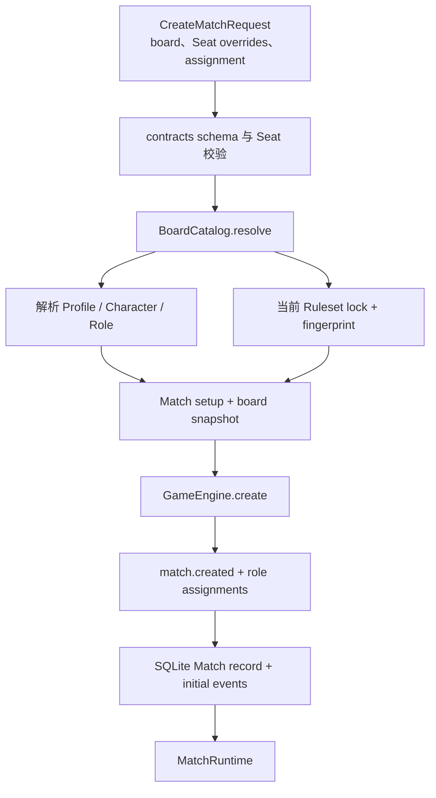
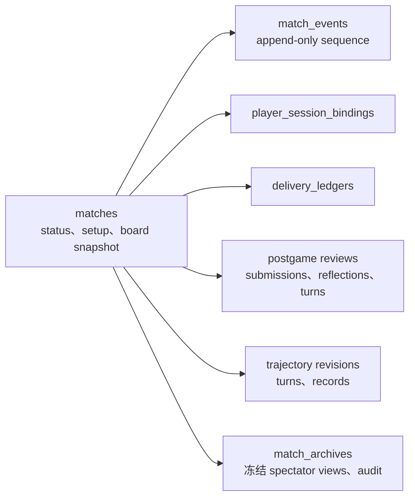
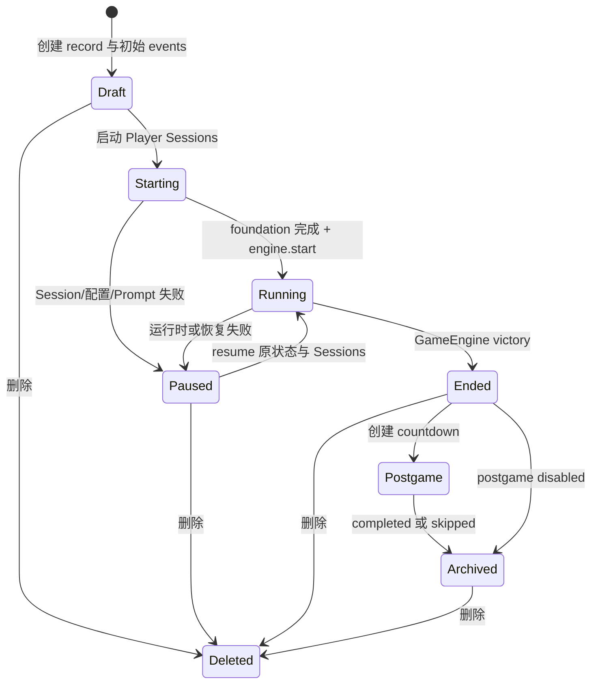
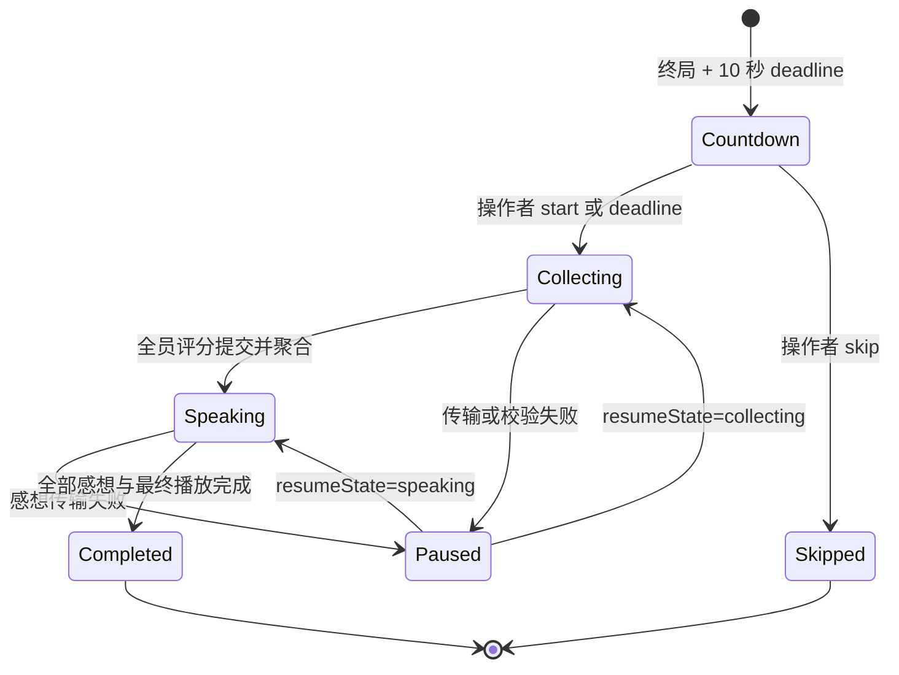

# Match 生命周期架构

本文描述 AgentWolf 如何把可编辑目录配置解析为一份不可变 Match，如何持久化和恢复运行时，以及
终局后如何完成评分、感想和资源关闭。目标读者是修改 Agent/Profile、board、Character、Match
repository、恢复、删除或 postgame review 的研发人员。游戏规则属于 GameEngine，ACP delivery 和
浏览器实时同步由对应专项架构负责。

## 设计目标与边界

Match 生命周期需要保证：

- 创建前目录可编辑，创建后的规则、Seat 与表达配置不随目录变化；
- 每个 Match 绑定可验证的 Ruleset lock、board policy 和逐 Seat setup；
- 领域事件、Session、delivery、postgame 与 trajectory 各自持久，并由明确 repository 拥有；
- 活跃 GameEngine 和 Agent 进程可以丢弃并从持久边界恢复；
- 暂停、继续、终局、赛后和删除拥有单向且可检查的状态转换；
- 删除只影响目标 Match 及其 workspace，不修改共享目录或其他对局；
- Character 只控制公开呈现，Profile 只选择 Agent 运行配置，二者都不进入规则求值。

`apps/server` 是生命周期组合根。contracts 定义持久/wire schema，game-engine 解释冻结 board，assets
提供 Character 和 Prompt，ACP 运行时建立玩家 Sessions，Web 通过 API 触发受支持的生命周期动作。

## 可编辑目录与配置所有权

创建 Match 前，server 暴露四类目录和一份全局设置：

| 配置            | 所有者              | 影响范围                                                       | 创建 Match 时的处理                                           |
| --------------- | ------------------- | -------------------------------------------------------------- | ------------------------------------------------------------- |
| Agent Tool      | Agent catalog       | ACP command、args、environment binding、默认 mode 与能力提示   | Player Session binding 保存所选 Tool 全量快照                 |
| Agent Profile   | Agent catalog       | Tool、model、reasoning、mode、timeout 与非机密 connection 配置 | Match setup 保存 Profile ID，Session binding 保存全量 Profile |
| board           | Board catalog       | Role card 牌池、底牌、席位、Sheriff、胜负政策和逐 Seat 默认值  | 解析为当前 board snapshot 与 GameEngine manifest              |
| Character       | Character catalog   | 公开名称、头像、traits、style、boundaries 与 opening           | 逐 Seat 保存不可变 Character snapshot                         |
| global settings | settings repository | 发言字符上限                                                   | 复制到 Match setup snapshot                                   |
| server rollout  | server config       | 公开发言 interrupt 的新 Match 默认模式                         | 复制到 Match setup snapshot                                   |

内置 Tool/board/Character 来自代码或 assets，自定义项来自 SQLite。Profile 保持显式排序，作为 Seat
没有任何 Profile 选择时的稳定 fallback。被 board 或其他目录记录引用的 Profile/Character 受到
catalog 删除约束；同一 Profile 或 Character 可以分配给多个 Seat。

Agent Tool 的 environment 只保存 process 变量名或 literal binding，不持久化解析后的 secret。
Character portrait 上传到托管数据目录，并以 asset ID 进入 Character snapshot；领域事件不携带
Character 卡或头像内容。

## 从配置到不可变 Match

下图说明创建请求如何经过目录解析、快照和持久化后成为可启动 runtime。

创建流程执行以下约束：

1. board 决定精确人数，Seat 必须从 1 连续编号且 Match 内昵称唯一；
2. Profile 按“请求显式值 → board Seat 默认值 → 首个有序 Profile”解析，最终每 Seat 必须有 Profile；
3. Character 按“请求显式值（可为 null）→ board Seat 默认值 → null”解析，并立即转成 snapshot；
4. manual assignment 的 Seat Roles 与底牌 Roles 必须共同匹配 board 牌池;random assignment 使用 Match
   稳定 seed 并只从 Ruleset deal validators 接受的组合中选择；
5. board summary 转为 snapshot，写入 Ruleset family/revision、plugin lock/config hash、fingerprint、政策与修订；
6. Match setup 写入逐 Seat 名称、Profile ID、可选 manual Role、manual reserve Roles、Character snapshot、
   发言上限和公开发言 interrupt 模式；
7. GameEngine 产生初始事件，repository 在创建 Match record 的同一事务中保存它们；
8. MatchManager 创建 trajectory recorder 与 MatchRuntime，并把 runtime 置入活跃表。

Match ID 同时提供可读 board 前缀与稳定随机 seed。确切 ID 生成和 wire 字段由 contracts/代码负责，
架构只依赖其 Match 内唯一和可重放属性。

## 快照与运行时配置

Match 使用两份互补快照：

- **board snapshot** 使用唯一 schema，固定 Ruleset family/revision、完整 Role card 牌池、底牌/席位数量、
  Sheriff、政策、目录来源、修订和 board 默认配置；只有当前 revision 可以恢复为运行时。
- **setup snapshot** 固定实际逐 Seat 选择、Match 级发言上限和公开发言 interrupt 模式；它保存 Character card 内容，但只
  保存 Profile ID。首次建立 Player Session binding 时，选中的 Profile/Tool 全量配置被进一步冻结。

目录编辑只影响后续创建。恢复可执行 Match 时，MatchManager 不重新解析当前 board/Profile/Character
默认值；它使用 record snapshot、Session binding 和事件日志。Character 数据位于事件日志之外，
因此改变公开表达配置不会污染游戏 replay。归档 Match 直接读取冻结视图，不恢复 runtime。

## 持久化架构

SQLite schema 按状态所有权拆分，而不是把整个 runtime 序列化成一行：

| 持久状态                 | 写入者                    | 恢复用途                                                   |
| ------------------------ | ------------------------- | ---------------------------------------------------------- |
| Match record             | MatchManager/MatchRuntime | board/setup、status、paused reason 与目录列表              |
| `match_events`           | MatchRuntime              | 当前 revision 的 GameEngine replay                         |
| Session bindings         | PlayerRuntime             | 精确 Profile/Tool、Session ID、bootstrap 与 pending action |
| delivery ledgers         | PlayerRuntime             | 每玩家 Prompt cursor 与不确定 attempt                      |
| postgame records         | PostgameReviewCoordinator | 赛后状态、评分、聚合、感想和逐玩家尝试                     |
| trajectory turns/records | trajectory recorder       | 运行时诊断与语义 audit                                     |
| `match_archives`         | MatchManager              | 规则无关的只读 MatchView 与冻结 audit                      |

repository 在 JSON 边界使用 contracts/本地 Zod schema 解析。`match_events` 以 `(match_id, sequence)`
唯一；Session、delivery、submission 和 reflection 以 Match/Player 唯一。Match 删除由外键 cascade
清理所属数据库记录。

数据库使用单调 `user_version` 前向迁移。server 拒绝打开高于当前实现的 schema；新增持久结构需要
同时提供迁移、全新数据库定义和迁移测试。

`AgentWolfSessionBindingStore` 将既有 player Session repository 暴露为 Core store port。产品 binding
继续保存完整 Profile/Tool snapshot 和 delivery ID；Core accepted callback 复用同一 pending action，
不创建第二张表。Match 删除仍由 MatchManager 的外键 cascade 统一拥有。

## Match 运行状态

Match record 与 GameEngine 共享同一组顶层状态，但各自职责不同：GameEngine 通过事件表达规则状态，
repository 保存跨进程可发现的生命周期状态。

### 创建与启动

Draft runtime 已有 GameEngine 初始事件，但不启动 Agent。`beginMatch` 将异步初始化交给活跃
MatchRuntime：先持久 status=starting 和 `match.starting`，并发建立玩家 Sessions、发送 foundation，
全部成功后调用 `engine.start`、持久 running 并开始 action loop。任一失败都会追加 paused event、
保存 reason 并保留可恢复状态。

### 暂停与继续

暂停保留 board/setup、全部事件、Session bindings、delivery、pending action 与 postgame/trajectory。
`resumeMatch` 对活跃 runtime 原地恢复；进程重启后则先从 snapshot 和事件 restore GameEngine，再
创建 MatchRuntime 并恢复精确 Sessions。repository 初始化会把被进程中断的未终局 Match 标为
paused，使恢复始终需要显式操作者动作。

只有当前 Ruleset revision 可以继续。发现非当前 revision 且没有 archive 时恢复失败关闭，由操作者
结束或删除该 Match；server 不自动迁移 action boundary、pending action 或 Session。

继续前，PlayerRuntime 对账 pending action 和 delivery；MatchRuntime 补齐未确认 bootstrap，再调用
GameEngine resume。恢复从当前 phase/action boundary 开始，不依据 Web snapshot 或 trajectory 推断
游戏状态。

### 终局

GameEngine 发出 `match.ended` 和最终 reveal，MatchRuntime 将 record 标为 ended。启用赛后流程时，
server 在首个 ended snapshot 前持久创建 countdown；关闭赛后流程的受控运行（如仿真）直接关闭
Sessions。赛后 completed/skipped 或禁用赛后流程时，MatchRuntime 关闭 Sessions，并为 god、
closed-eye 与每个 Player view 生成一份 `MatchArchive`。archive 保存终局 MatchView 和 trajectory
audit，之后列表、查看与 WebSocket 视角切换均不再读取 GameEngine、Ruleset 或 Role registry。

archive 是 Match 的只读边界：start、resume 与 postgame controls 返回 `match-read-only` conflict；
删除仍然可用。simulation capture 可以只读消费 Match 保留的 setup、board snapshot、事件与结构化
轨迹，但不恢复运行时或修改 archive。完整投影集合只存在于 server/SQLite，响应只选择请求视角对应的
一份 MatchView。

## 赛后复盘状态机

赛后复盘是 server 编排，不属于确定性游戏事件日志。它冻结 GameEngine victory registry 返回的
明确 winning Player IDs，并以其补集作为 losing Player IDs；MVP/SVP 资格不依赖中央 Role 或
Faction 分支。

### 全员评分

每个 Seat 使用原逻辑 ACP Session 提交一份评分表：

- 从 winning 集中提名一名 MVP，从 losing 集中提名一名 SVP；候选集存在其他玩家时不能提名自己；
- 为除自己外的每名玩家提交 information、communication、decision、objective、adaptability 五项
  1–10 整数评分。

ActionMailbox 在 accepted receipt 前调用 eligibility validator 并保存 submission。repository 对
reviewer 唯一且允许相同重试幂等；MatchView 立即显示已接受评分表。每位模型的 Prompt 使用冻结终局
snapshot，不包含其他评审者的评分内容。

全员提交后，aggregator 为每位玩家计算各维度算术平均与 overall。MVP/SVP 先比较提名票数，再比较
精确评分总分，仍相同时使用由 Match ID、奖项和候选 Player ID 派生的稳定 draw。原始 submissions、
聚合 result 和 award resolution method 分别持久，浏览器可以解释结果来源。

### 感想与关闭

进入 speaking 后，coordinator 按 Seat 顺序请求感想。每份感想沿 direct speech stream 进入
activeSpeech、LiveHub、SpeechBubble 和自动播报；最终文本经过 Player ID sanitization 后以 postgame
reflection 独立保存。最后一份感想的播放边界释放后状态变为 completed，随后关闭全部原玩家
Sessions。skip 同样关闭 Sessions；已经进入 collecting/speaking 的 review 不能跳过。

completed/skipped 是 archive 的生成边界。复盘结果、评分与感想已经进入冻结 MatchView，历史读取
无需重建 postgame coordinator 或恢复玩家 Sessions。

逐玩家 postgame turn record 保存 submission/reflection 的 attempts、uncertain failure 和错误。
第一次不确定失败可以在同 Session 上续篇；重复失败把 review 置为 paused 并保留精确 resumeState。

## 删除与资源回收

删除流程先解析精确 Match ID，再执行：

1. 关闭活跃 MatchRuntime、playback、postgame coordinator 与 Player Sessions；
2. 撤销该 Match 所有 MCP token，关闭 inactive WebSocket connections；
3. 删除 Match row，让外键 cascade 清理事件、Session、delivery、trajectory、postgame 与 archive；
4. 校验数据目录下的精确 Match 路径，只递归移除该 Match 的玩家 workspaces；
5. 从 MatchManager active/inactive maps 移除引用。

Agent Tools/Profiles、自定义 boards、Characters、共享玩家 Skill 输出、头像目录和其他 Match 不属于
删除目标。未知 Match 返回 404，浏览器据此进入不可用终态。

## 故障与可观测性

- Create request、目录输入、snapshot 和数据库 JSON 在边界解析；Seat、引用、Role multiset、Ruleset
  revision 或 fingerprint 不合法时不会创建可运行 Match。
- MatchRuntime 的规则、Prompt、Session 或持久化错误统一转为 paused 状态与可见 reason，保留恢复
  所需记录。
- postgame 不完整输入、重复/冲突提交和非法状态转换返回稳定 conflict；传输失败保留 turn record。
- archive 投影读取不执行领域规则；归档后的运行控制返回稳定只读 conflict，仿真采集从保留的不可变
  来源事实独立重建 candidate。
- MatchView、领域事件、Session/delivery debug、postgame view 和 trajectory 提供从产品状态到协议
  细节的分层观测；浏览器本地状态不作为恢复证据。

## 扩展边界与不变量

- 新目录字段先定义 contracts schema，再明确是否在 Match 创建时冻结；会影响既有 Match 的事实必须
  进入 snapshot，而不是恢复时重新读取目录。
- 新持久状态归属最窄 repository，并提供前向迁移、删除 cascade 和解析边界。
- 新 lifecycle action 由 MatchManager/MatchRuntime 组合，不在 Web 或 GameEngine 建立平行状态机。
- Character 永远只影响公开呈现和表达；Profile/Tool 只影响 Agent 运行配置。
- board snapshot、setup snapshot、Session binding 和 append-only events 共同构成当前 Match 的恢复依据。
- server 启动配置只决定新 Match 默认值；恢复始终使用 setup snapshot 中冻结的 interrupt 模式。
- 完成赛后流程的 Match 只由 archive 投影读取，历史 Ruleset 不具有 runtime factory。
- postgame 数据与 game events 分离，不能改变 GameEngine replay 或 simulation 终局 oracle。
- 删除必须先关闭运行对象，再清理精确 Match 持有的数据库与 workspace。

## 深入阅读

- [系统架构](../architecture.md)：跨模块状态所有权。
- [游戏运行时](game-runtime.md)：Ruleset lock、事件与 replay。
- [ACP Session 运行时](acp-session-runtime.md)：Session binding、delivery 与恢复。
- [信息同步](information-synchronization.md)：首个终局 snapshot、评分和感想呈现。
- [轨迹](trajectory.md)：诊断数据与 Match 删除边界。
- [仿真](simulation.md)：source snapshot、事件与 postgame 排除边界。
- [Server package](../../apps/server/README.md)：repository 与 lifecycle owner map。
