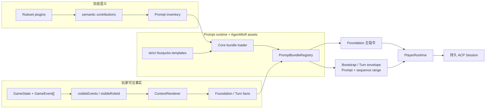
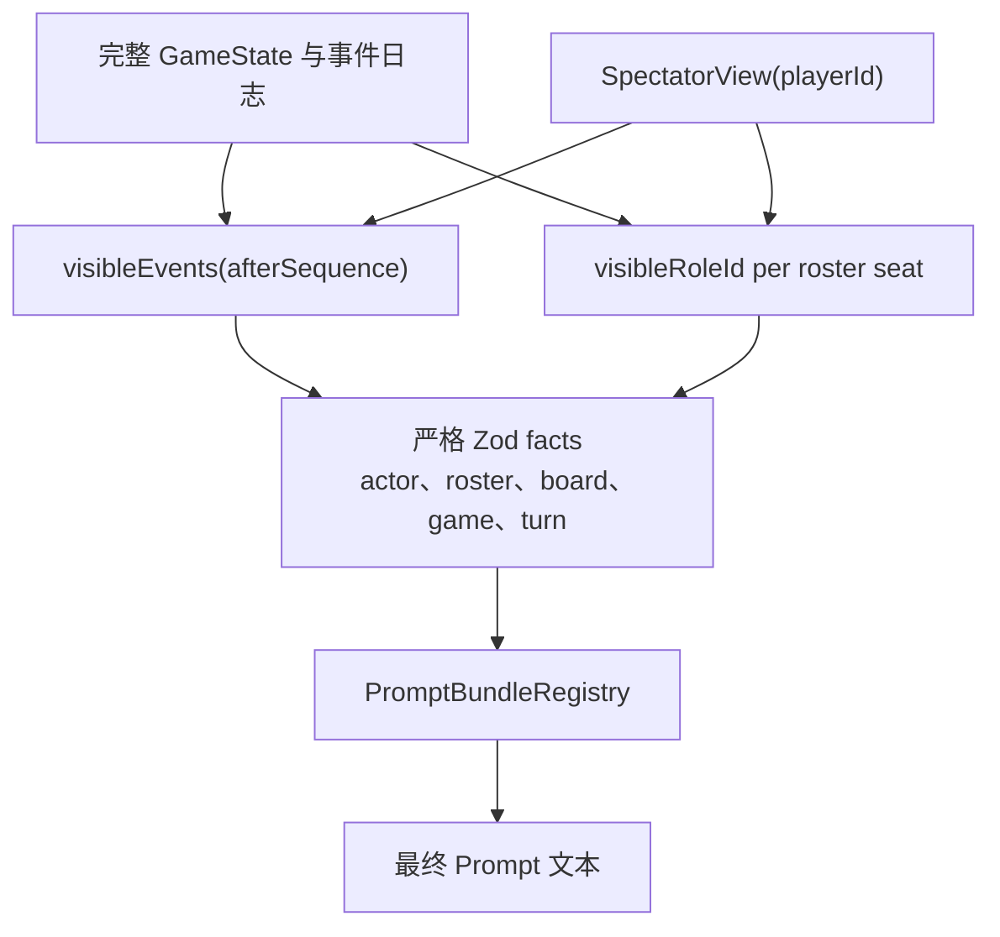
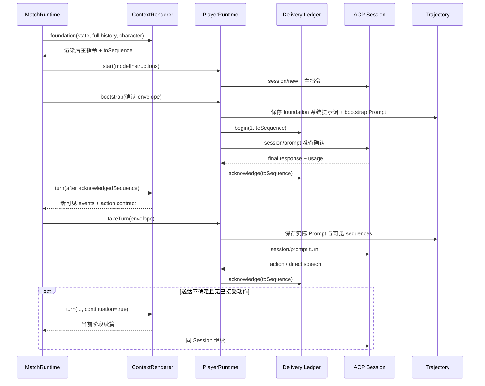
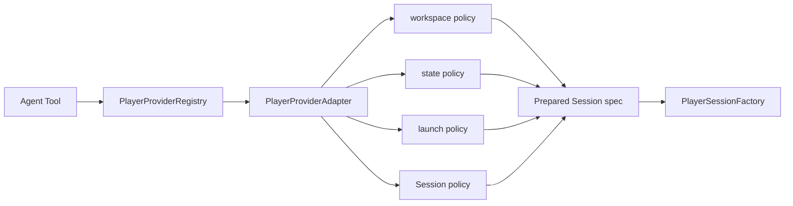

# Prompt 与玩家上下文架构

本文描述 AgentWolf 如何把锁定 Ruleset 的语义、某位玩家可见的 Match 事实和当前动作契约转换为
发送给长驻 ACP Session 的 Prompt。目标读者是修改 Prompt bundle、事实投影、玩家 Skills、模型
工具边界或上下文审计的研发人员。规则求值属于 game-engine，Session 送达与恢复属于 ACP Session
运行时。

## 设计目标与信任边界

Prompt 管线同时满足以下约束：

- 具体 Role、Ability、Phase 和 plugin event 的模型呈现由其 RulePlugin 对应 bundle 拥有；
- 模板只接收 server 已经按玩家身份过滤的 plain facts，不能提升事实可见性；
- foundation 在 Session 建立前成为不可变主指令，bootstrap、增量 turn 和恢复续篇各有
  明确送达边界；
- 玩家发言保持原始语义，裁判呈现只格式化权威事件和身份引用；
- Prompt 源非本地化、严格渲染并在首次使用前完成 bundle 图与语义覆盖校验；
- 玩家进程只获得游戏所需的 Skills、知识工具和动作工具，宿主开发上下文不进入模型环境；
- 实际发送的 Prompt 与上下文 usage 被持久记录，审计依据发送时事实而非当前模板回算。

[Core Prompt runtime](../../vendor/agent-arena-core/packages/prompt-runtime/README.md) 拥有路径包含、静态
import、依赖环、预编译、audience 单调性、声明式 matcher 与 semantic coverage 算法。
[`packages/assets`](../../packages/assets/README.md) 拥有 AgentWolf manifest schema、bundle 源、facts、
helpers 与 registry 呈现。server 的 `ContextRenderer` 拥有 game-engine 状态到 plain Prompt facts 的
适配；assets 不依赖 game-engine，因此模板运行时不能绕过 server 读取隐藏状态。

## 组件与数据流

下图展示两条输入如何在 registry 汇合：Ruleset semantic contributions 决定必须安装哪些 bundle，
玩家视图决定本次模板实际能看到哪些事实。

| 组件                           | 拥有的职责                                                                      | 关键产出                              |
| ------------------------------ | ------------------------------------------------------------------------------- | ------------------------------------- |
| semantic ownership recorder    | 记录每个 plugin 实际注册的 Role、Ability、Phase、event、query 与 trigger        | `PluginSemanticContribution[]`        |
| `promptInventory`              | 将 Ruleset plugin 顺序、贡献、交互 phase 与 core event 类型转换为 assets 侧清单 | `PromptSemanticInventory`             |
| Core bundle runtime            | 读取模板，验证路径、imports、audience、matcher 与循环，预编译模板               | `LoadedPromptBundle[]`                |
| `PromptBundleRegistry`         | 冻结 Role/Ability/Phase/event 的呈现所有权，匹配事件并渲染 Prompt               | foundation、turn、event narration     |
| `ContextRenderer`              | 选择玩家可见事件和 Role，构造 actor/roster/board/game/turn facts                | foundation 主指令与 `ContextEnvelope` |
| `PlayerRuntime`                | 把 envelope 与 delivery ledger、Session、trajectory 关联                        | 一次可确认的 ACP Prompt 送达          |
| player Skill builder/workspace | 构建共享游戏 Skills 并链接到每个 Seat workspace                                 | 隔离的 Agent 工作目录                 |

## Bundle 所有权与装载

Prompt 根由 `_core` 和与已安装 RulePlugin 一一对应的 bundle 构成：

- `_core` 拥有 foundation、bootstrap、continuation、bootstrap continuation、Character、player contract
  布局，
  通用 faction 标签、MCP tool schema 文案和 MCP 回执；
- plugin bundle 拥有该 plugin 注册的 Roles、Abilities、Phases、plugin events 与公告呈现；
- manifest 只允许声明自身语义、显式 imports 和带 audience 的 shared templates；
- 模板引用必须位于 bundle 根内，loader 拒绝绝对路径、`..`、反斜线、symlink、动态 import 和
  非 `.njk` 文件；
- Prompt 根不能引入 locale/i18n 目录，模型语言保持为一份确定的游戏契约。

manifest 中每个 event/announcement presentation 必须在 `text`、`template` 和 `omit` 中恰选一种。
event matcher 由 payload type 与可选 `where` 条件组成；registry 选择 specificity 最高的唯一匹配。
缺失匹配或同 specificity 的重叠匹配会使 registry 构建/渲染失败，避免同一事件静默选择不同文本。

bundle 图同时执行两类校验：

1. **安装覆盖**：每个 Ruleset contribution 中的 Role、Ability、Phase 和 plugin event 必须由同 ID
   bundle 精确呈现，bundle 也不能声明未被插件拥有的语义；每个交互 phase 必须有 turn template，
   每个 core event 必须有呈现或显式 omission。
2. **audience 单调性**：跨 bundle 只能引用被导出的 shared template；public 资产只能组合 public
   内容，player/faction 资产不能互相越权，god 资产可以组合更窄 audience。模板组合不能成为隐私
   升级通道。

首次请求某个 `RulesetRuntime` 时，server 构建 registry 并用 WeakMap 按 runtime 身份缓存。所有
模板在冻结前预编译，缺失变量通过 Nunjucks `throwOnUndefined` 立即失败。

## 可见事实投影

Prompt privacy boundary 位于 `ContextRenderer` 之前，而不是 Nunjucks 条件语句中。

`ContextRenderer` 构造以下稳定事实：

- actor：当前玩家的 Player ID、Seat、昵称、生存状态、Role、Faction 和 ability usage；
- roster：按 Seat 排序的公开身份，以及该玩家通过自身、阵营共享、公开 reveal 或终局可知的 Role；
- board：完整 Role card 牌池、席位/底牌数量、Faction、Sheriff 开关、冻结政策，以及从 phase graph
  提取并按当前板子过滤的夜间行动顺序；
- game：day、night、status 与 paused reason；
- events：送达游标之后对该玩家可见且保持原 sequence 顺序的事件；
- turn：phase、action type、speech/vote kind、可用 abilities、pass 许可、actor-specific Role Card
  choices、interrupts、后台 interrupt 窗口、Sheriff actions 和发言上限；
- Character：仅 foundation 中该 Seat 的不可变公开表达卡。

允许的 ability/interrupt 在进入 facts 前再次按 actor 当前 capability 过滤。Prompt registry 提供
Player/Role/Ability/Phase/Faction 标签和可见事件 helper，但 helper 只能查询传入 facts，不能访问
GameEngine 或 repository。

## Prompt 生命周期与送达边界

下图说明 foundation 主指令、bootstrap 确认、普通 turn 与恢复续篇如何共享同一
Session。

### Foundation

foundation 要求输入历史的最后 sequence 与 GameState `lastSequence` 完全相同。它一次性呈现公开 board
牌池/底牌规则、警长与放逐平票规则、狼刀在先规则、夜间行动顺序、公开 Role 说明、actor 自身
Role/Abilities、可见阵营知识、初始可见事件、完整初始 roster 和 Character。结算语义由
[游戏结算与终局](game-settlement.md)拥有。渲染结果在首次 `session/new` 前固化为该 Seat 的主指令，进程恢复继续
使用同一份内容。公开 Role 说明描述 board 中存在的语义，不建立 Seat 到隐藏 Role 的映射。

player-session binding 在 bootstrap 确认前处于 `bootstrapState=pending`。派发前改为
`dispatched`，delivery 确认后改为 `acknowledged`。若进程在派发后中断，恢复同一
Session 并发送紧凑 bootstrap continuation，不重复主指令。

### 增量 turn

增量 turn 从玩家 `acknowledgedSequence` 之后选择事件，并附加当前 action boundary。玩家自己已经
提交且保留在长驻 Session 中的内容通过事件呈现策略避免冗余；其他玩家的必需公开发言保持在顺序
历史中。turn envelope 的 `toSequence` 固定为渲染时 GameState 最后 sequence。

当 delivery 不确定且没有持久 pending action 时，ledger 对账该范围并将 `continuationPending` 设为
真。下一 Prompt 使用同一 phase/actor 边界和 continuation layout，只说明当前需要完成的动作，不
复制 foundation 或完整对局历史。

rolling listener 使用同一增量事实管线。它只接收自身确认游标之后可见的公开事件与当前合法
interrupt abilities。较新的发言 supersede 旧 listener 后,确认取消的 delivery 推进同一游标；下一
Prompt 因而只呈现尚未送达的发言。listener 模板呈现 Role 化的当前决策目标、当前应调用的正式工具名、禁止输出发言边界，以及新增事件。它不渲染普通回合的当前天数与存活名册摘要，也不复制工具字段、枚举、空值或目标结构。
MCP tool description 与 input schema 独立承载具体调用契约。每个 Ability 的语义说明属于 Prompt bundle,
并注入当前 ability schema;当前 expectation 将可用 Ability、Role Card choice 与 Sheriff action 收窄为
schema enum。Role Card action 继续使用 `submit_night_action`,Player targets 为空并提交独立
`roleCardId`,不把卡牌选择编码进 `option`。

玩家提交 Role 转换动作后,转换事件位于其 delivery cursor 之后。下一份增量 turn 同时呈现事件叙述
和最终 Role 的 owner 契约;若最终 Role 在同一夜拥有后续 phase,该契约与对应 ability schema 一起
到达同一持久 Session。无权看到转换的玩家不会收到事件或 owner 文本。

### 赛后 Prompt

赛后评分和感想使用独立的 `PostgamePromptAssets`，但沿用原玩家 Session。首份评分 Prompt 从该
玩家常规 cursor 之后补齐公开终局历史，包括 Role plugin 追加的公开关系揭晓，随后使用冻结的
terminal snapshot、候选集合和评分目标；重试使用专用 continuation。感想 Prompt 包含聚合结果与
先前公开感想，并通过普通 direct speech stream 进入 Web。赛后数据不进入游戏事件日志。

## 玩家环境与工具边界

构建阶段把 `packages/assets/player-skills` 生成到 `.agentwolf/skills`。每个 Match/Player workspace
只创建相对 symlink，使 `.agents/skills`、`.claude/skills`、`.trae/skills` 和 `.codebuddy/skills`
指向同一共享构建输出。
Match workspace 同时拥有该 Seat 的 Provider home。Provider home 只引用宿主登录凭据并保存该玩家的
Session 状态，不继承宿主 settings、记忆或全局指令。Claude 与 CodeBuddy 从不含仓库祖先指令的
临时 launch workspace 运行；该目录只链接玩家游戏 Skill 入口，并在删除 Match workspace 时一同
清理。

下图表达 Provider 差异如何在 ACP 边界内收敛。Session factory 只消费已准备的 spec，
不识别具体 Provider。

Registry 优先使用精确 Tool ID 绑定，再使用 Tool kind 绑定。Workspace policy 拥有
launch 目录的 resolve、prepare 和 cleanup 生命周期；state policy 拥有 Provider home 与凭据
引用；launch 和 Session policy 分别拥有进程配置与 ACP 能力声明。

Provider 启动策略统一执行以下环境契约：

- 只暴露 `agentwolf-player` 与 `werewolf-strategy` 游戏 Skills，宿主、祖先目录与 bundled Skills 不进入
  玩家上下文；
- 暴露本地只读知识工具和七个声明的 MCP 动作工具；
- MCP endpoint 使用只绑定当前 Match/Player 的 bearer token；
- 移除环境记忆、仓库项目指令、Web、插件、hooks、子代理、写入与无关开发能力；
- Trae 与 Codex 使用固化的 foundation 主指令，并启用工作区 Skill 发现；两者分别使用
  Match-owned `TRAE_HOME` 和 `CODEX_HOME`；
- Claude 使用 foundation system prompt、project-scoped Skill source、严格无网络和禁止文件写入的
  sandbox；
- CodeBuddy 使用 foundation system prompt、project settings source、Match-owned 配置目录、禁用
  IDE、严格 MCP 与只读工具白名单；
- 自定义 Agent Tool 没有内置隔离适配器，不能启动玩家 Session；
- 玩家 bearer token 只进入进程环境绑定，不进入启动参数中的 MCP 配置文本。

foundation 是当前 Seat 的主指令，turn Prompt 提供 Role 化的行动目标、正式工具名与提交边界，
`agentwolf-player` 与 `werewolf-strategy` 作为独立 Skill 按名称发现并按需加载，MCP schema 承载
Ability 语义、字段和参数结构。
每个 bootstrap trajectory 对 Provider 报告的 context usage 执行 12,000 token 预算审计。

## 状态、故障与可观测性

| 状态                             | 所有者                       | 生命周期                                   |
| -------------------------------- | ---------------------------- | ------------------------------------------ |
| Prompt 源与 manifests            | assets 源目录                | 随代码版本发布，非本地化                   |
| bundle registry                  | `PromptBundleRegistry`       | 按冻结 Ruleset runtime 构建并缓存          |
| facts/envelope                   | `ContextRenderer`            | 单次渲染快照，携带精确 sequence 范围       |
| delivery cursor                  | `PlayerRuntime` / repository | ACP 最终确认或恢复对账后推进               |
| 系统提示词、实际 Prompt 与 usage | trajectory                   | 生效或发送时持久，历史记录不回算           |
| 玩家 Skills                      | assets builder / 数据目录    | 构建一次，多个 workspace 只链接            |
| foundation 主指令                | Match/Player workspace       | 首次 Session 前固化，随 Match 删除         |
| Provider home                    | Match/Player workspace       | 随 Seat Session 创建，随 Match 删除        |
| detached launch 目录             | ACP player isolation         | Claude/CodeBuddy 启动前创建，随 Match 删除 |

- bundle 缺失、语义覆盖不全、非法 import、audience 越权、模板未定义值或事件呈现歧义会在 registry
  建立或渲染时失败；MatchRuntime 在应用边界暂停 Match。
- foundation 历史与 state sequence 不一致会拒绝渲染，避免遗漏或重复初始事实。
- roster 玩家缺少最终 Role/Faction、公开历史 cursor 越界或 postgame terminal sequence 不匹配会
  明确失败。
- trajectory 在 bootstrap Turn 保存完整 foundation 系统提示词,并保存各 Turn 的 Prompt、可见 event
  sequences、usage、reasoning/message/tool updates 和错误；
  审计重建渲染时状态并验证可见范围与 context budget，不把历史文本和当前模板逐字比较。

## 扩展边界与不变量

- 新 plugin 语义必须由同 ID Prompt bundle 精确覆盖；通用 Prompt runtime 不增加具体 ID dispatch。
- 新 facts 先在 assets 侧 Zod schema 定义，再由 server 从 visibility-safe 状态适配；模板不能接收
  原始 GameState。
- 新跨 bundle 复用只通过带 audience 的 shared template；公开资产不能引用更私密资产。
- 新动作工具同时更新 core manifest、MCP gateway、玩家工具 allowlist、contracts 与边界测试。
- 新 ACP Provider 必须注册完整 adapter，提供 workspace/state/launch/Session policy，并保证
  替换指令、环境来源关闭、工具白名单与凭据隔离均可验证。
- Prompt 只描述当前任务和事实，结构化规则仍由 GameEngine/ActionMailbox 校验。
- 玩家撰写的 speech 不由事件 renderer 改写策略含义；未知 Player ID 在提交边界拒绝。
- 任何历史 Prompt 的审计依据是实际存储文本、sequence 和 usage，而非当前源重新渲染。

## 深入阅读

- [系统架构](../architecture.md)：事实流、信任边界和端到端回合。
- [游戏运行时](game-runtime.md)：semantic contributions、事件和动作契约来源。
- [ACP Session 运行时](acp-session-runtime.md)：delivery ledger、Session 与恢复。
- [信息同步](information-synchronization.md)：玩家可见事件、phase 与公开发言顺序。
- [Assets package](../../packages/assets/README.md)：导出边界与资产所有权。
- [Core Prompt runtime](../../vendor/agent-arena-core/packages/prompt-runtime/README.md)：bundle 安全、
  静态 audience、matcher 与 semantic coverage。
- [游戏目录](../generated/game-catalog.md)：源码生成的 plugin/Prompt 覆盖清单。
