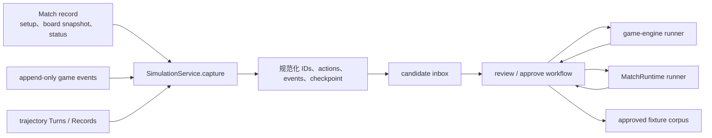
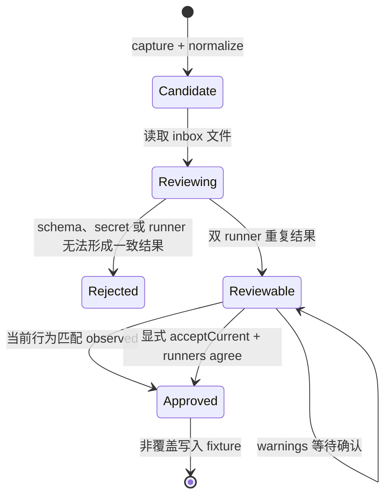
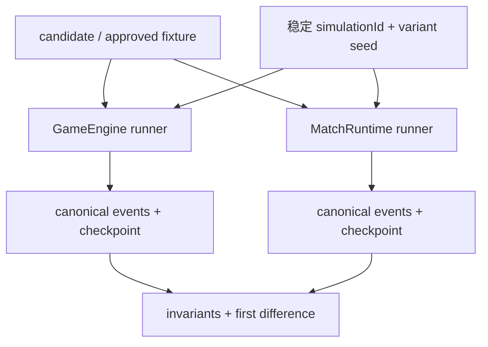

# 确定性仿真架构

本文描述 AgentWolf 如何从已结束或暂停的 Match 采集可审查 candidate，通过 game-engine 与生产编排
两条 runner 验证当前行为，并批准紧凑、版本化的测试 fixture。目标读者是修改 simulation schema、
capture、规范化、runner、评审或批准工作流的研发人员。仿真是测试语料生产模块，不参与生产 Match
推进、恢复或投影。

## 设计目标与输入边界

仿真模块需要保证：

- capture 只读取不可变 Match snapshot、游戏事件和结构化轨迹，不修改来源 Match；
- 原始标识符、时间、路径和运行环境被规范化，Prompt、reasoning、tool output 与 credentials 不进入
  fixture；
- candidate 保留完整 canonical event 观察结果供评审；
- approved fixture 只保存紧凑、稳定的 event oracle 与终局 checkpoint；
- game-engine runner 与 orchestration runner 独立复现同一行为，并重复执行证明确定性；
- 并行完成顺序、delivery failure、restart 和 playback 等控制轴通过显式 variants 验证；
- warnings、secret scan、runner divergence 和 oracle 接受都需要明确决策；
- candidate 与 fixture 均采用非覆盖写入。

`SimulationService` 持有生产数据到 candidate 的采集；canonical helpers 持有 ID/时间/事件规范化；
`simulation-workflow` 持有评审与批准；两个 runner 持有独立执行路径。轨迹模块只提供只读 Turn/Record
事实与 audit 结果，详见[轨迹架构](trajectory.md)。

## 组件与数据流

| 组件                  | 拥有的职责                                                                   | 主要产出                                   |
| --------------------- | ---------------------------------------------------------------------------- | ------------------------------------------ |
| `SimulationService`   | source eligibility、动作/控制提取、trajectory audit 与 candidate 构造        | `SimulationCapture`                        |
| canonical helpers     | 稳定 ID/时间替换、事件/action 规范化、checkpoint、fingerprint 与 secret scan | canonical setup/turns/events               |
| `simulation-workflow` | candidate 读取、双 runner 重复执行、warning/secret gate 与非覆盖批准         | review/approval result                     |
| engine runner         | 直接驱动全新 GameEngine action boundaries                                    | canonical events 与 checkpoint             |
| orchestration runner  | 驱动真实 MatchRuntime、ActionMailbox、内存 repository 与 fake Sessions       | 编排结果、trajectory audit 与 barrier 检查 |
| approved corpus       | 保存人工接受的 setup、turns、controls、variants 与 oracle                    | 免凭据回归 fixture                         |

## Candidate 采集

capture 只接受 ended 或 paused Match，并要求：

- 存在不可变 board snapshot；
- 至少一个结构化、非 system、非 postgame trajectory Turn；
- 没有 running Turn；
- 领域事件包含每个 Seat 的 Role assignment；
- action Record 能解析为结构化 PlayerAction；
- Match setup、speech limit、事件和 Turn range 可以通过 contracts schema 校验。

`SimulationService` 读取逐 Seat setup、board snapshot、游戏事件、非 postgame Turns、accepted actions、
Turn 完成 revision 顺序和 playback controls。每个 action Turn 在其 `toSequence` 处 restore GameEngine，
补充 phase mode 与 expected actors；不能重建的边界保留 warning/fault，不伪造 action。

Turn fault 将 failed/uncertain/cancelled 与错误文本归类为 uncertain-delivery、timeout、process-exit、
invalid-action、cancelled 或 other。已完成但没有对应 accepted domain action 的 Turn 标记为
invalid-action，使 runner 可以验证暂停语义。

capture 同时运行 trajectory audit，并把 audit issues、source reconstruction 和 sensitive-content scan
转换为明确 warnings。source Match、repository 和 trajectory 始终只读。

## 规范化与 Candidate 结构

规范化建立稳定 replacements，统一 Match、board、Profile、Session、delivery、Player 名称、Character、
时间和路径。nested action Match ID 与领域事件 payload 使用同一 canonical identity。事件移除
`occurredAt`，保留 sequence、visibility 与 payload；运行状态转成稳定 checkpoint。

candidate 包含：

- 规范化 setup 与逐 Seat Role/Character；
- 每个 bootstrap/action Turn 的 phase、action type、mode、expected actors、event range、attempt、
  completion order、fault 与 action；
- playback enable/resolve/disconnect controls；
- 完整 canonical events 与 terminal checkpoint；
- source status、cutoff、fingerprint 和 warnings。

checkpoint 保存 status、day/night、phase、winner、Sheriff、alive/voting Players 与 lastSequence。原始
Prompt、reasoning、message/tool output、credentials、diagnostics、运行时路径、postgame rows 和
postgame Turns 不进入 candidate。

candidate ID 由规范内容 fingerprint 派生，并写入 `.agentwolf/simulations/inbox`。写入使用 exclusive
create；同 ID 文件已存在时只确认可读，不覆盖内容。CLI 与浏览器使用同一个 workflow，并只传受
schema 约束的 simulation ID。

## 评审与批准

评审对 engine runner 和 orchestration runner 各执行两次，分别计算：

- engine deterministic 与 replay ok；
- orchestration deterministic 与 orchestration ok；
- 两个 runner 的 canonical result 是否一致；
- candidate warnings 与 secret warnings；
- candidate observed 与当前执行结果的首个语义差异。

批准必须满足：

- secret warnings 为空；
- capture warnings 已显式 acknowledge；
- observed 与当前结果一致，或调用者显式 `acceptCurrent`；
- `acceptCurrent` 只在两个 runner 各自确定且彼此一致时可用；
- 已存在 fixture 的 source fingerprint 与 expected oracle 与本次完全相同。

approved fixture 保存 setup、turns、controls、variants 和 reviewed expected。expected 使用 event count、
SHA-256 digest、event type sequence 与 checkpoint 表示，不复制 candidate 的完整 event payload。

## 双 Runner 架构

两个 runner 从不同层验证同一个 oracle：

| Runner               | 执行边界                                                                     | 主要验证                                                                                 |
| -------------------- | ---------------------------------------------------------------------------- | ---------------------------------------------------------------------------------------- |
| engine runner        | 新 GameEngine，直接在当前 action boundary 提交采集动作                       | phase/actor/action、事件顺序、结算、胜负与 checkpoint                                    |
| orchestration runner | 真实 MatchRuntime + ActionMailbox + in-memory SQLite + fake durable Sessions | Prompt/delivery、parallel barrier、Session recovery、restart、playback 与同一事件 oracle |

engine runner 对 sequential phase 只取首 actor，对 parallel phase 要求完整 actor set，并按照 variant
调整 completion/submit 顺序。orchestration runner 在临时数据目录建立 Agent/Profile 与 Match record，
用 replay Session 通过真实 MCP mailbox 执行动作；结束后运行 trajectory audit 和 parallel Prompt
barrier 检查。

ended fixture 的 variants 可以覆盖 recorded、parallel seat/reverse order、transient delivery、
restart boundary 与 playback completed/skipped/disconnected。paused fixture 只声明适用的 variants。
每个 `(simulationId, variant)` 产生稳定 seed，重复执行必须返回相同 canonical result。

## 故障、可观测性与扩展边界

- source Match 不存在、状态不适用、缺 snapshot/Role/trajectory/action 或存在 running Turn 时，capture
  返回 source conflict 且不写 candidate；
- candidate schema、路径、secret、warning acknowledgement 与 overwrite 冲突由 workflow 分别拒绝；
- runner 报告结构性 invariant、trajectory audit、初始化错误、oracle divergence 和 first difference；
- 新 variant 必须明确只改变 completion、recovery、restart、playback 或其他一个控制轴；
- 新 capture 字段只有影响确定执行或人工审查时才进入 schema，诊断详情留在 trajectory；
- 新 runner 检查必须基于生产契约或稳定 oracle，不能依赖 Agent 自我报告。

## 架构不变量

- 仿真只读消费来源 Match、事件与轨迹，不改变生产状态。
- capture 排除 postgame、raw model stream、credentials、diagnostics 与运行时路径。
- candidate 保留完整 observed events，approved fixture 保存紧凑 reviewed oracle。
- candidate 与 approved fixture 均非覆盖写入。
- engine 与 orchestration runner 必须各自确定且彼此一致，才能接受当前行为作为 oracle。
- parallel replay 使用完整 actor barrier，sequential replay 每次向当前运行时查询 actor。
- approved oracle 由稳定 digest、event types 和 checkpoint 表示，可独立检测语义漂移。

## 深入阅读

- [系统架构](../architecture.md)：确定性回归流与生产运行时的边界。
- [轨迹架构](trajectory.md)：Turn/Record、脱敏与 audit 输入。
- [游戏运行时](game-runtime.md)：engine runner 的 action boundary 与 replay 语义。
- [ACP Session 运行时](acp-session-runtime.md)：orchestration runner 的 delivery 与恢复契约。
- [信息同步](information-synchronization.md)：parallel barrier 与 playback controls。
- [Match 生命周期](match-lifecycle.md)：snapshot、事件和 source 状态边界。
- [测试与验收](../testing.md)：fixture 策略和 simulation corpus 门禁。
