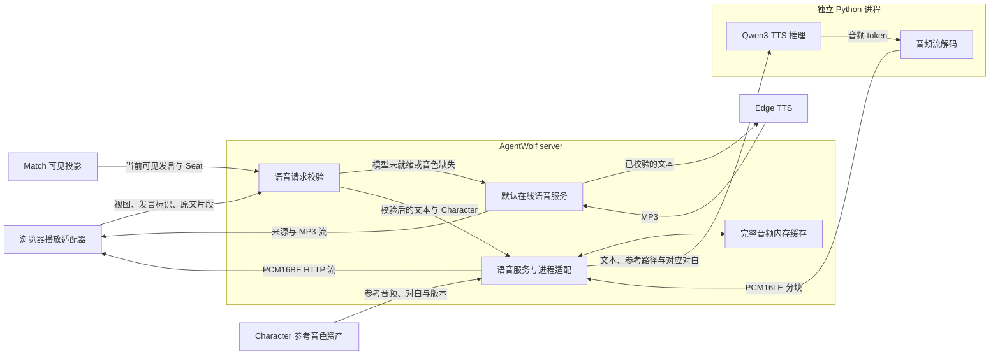
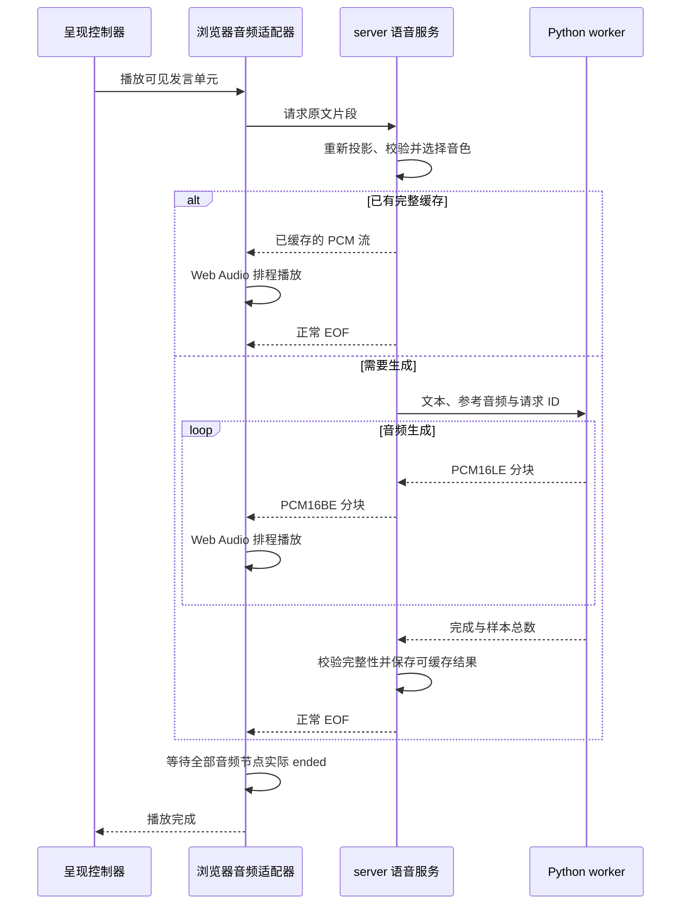

# 角色语音与发言播放

角色语音把当前视图可见的玩家发言转换为 Character 音色，并以音频分块交给浏览器播放。本文面向
维护音色资产、server、Python 推理与 Web 播放的研发人员，说明这些组件的信任边界、状态归属和
取消语义。HTTP 契约由 [server README](../../apps/server/README.md) 拥有，进程协议与模型准备
命令由 [TTS runtime README](../../scripts/tts/README.md) 拥有。

语音属于发言呈现层。游戏事实、自然语言发言提交和阶段推进仍由 Match runtime 持有；语音生成
不能改写发言或自行推进游戏。播放控制者、发言送达和阶段门控见[信息同步](information-synchronization.md)。

## 系统边界与职责

浏览器提出可见发言的播放请求，server 决定可使用的文本与 Character，Python 只接收已选择的
文本和参考音频。下图说明数据如何经过可见性边界，再转换成浏览器可播放的音频。

缓存位于请求校验之后。每次播放，包括缓存命中，都先重新取得当前视图投影；浏览器提供的
Character、音色文件路径或任意文本不能成为推理依据。

| 所有者              | 决策与持有状态                                       | 输入与输出边界                                                                      |
| ------------------- | ---------------------------------------------------- | ----------------------------------------------------------------------------------- |
| assets 参考音色目录 | 内置 Character 到参考 FLAC、内容摘要与音色版本的映射 | 通过仅 server 使用的 `@agentwolf/assets/voices` 入口提供清单，音频不进入 Web bundle |
| server 语音路由     | 发言在请求视图中的可见性、文本归属与 Seat Character  | 消费 `MatchView`；只向语音服务提交可见原文片段和已确定的 Character                  |
| server 语音服务     | 准备状态、音色物化、推理进程生命周期与完整音频缓存   | 读取资产与运行配置；提供状态和音频流                                                |
| Node 进程适配器     | 请求队列、当前请求、取消、分块顺序与输出完整性       | 解析 worker 消息，校验采样格式、顺序和最终样本总数，将 PCM 字节序转换到 HTTP 格式   |
| Python worker       | 共享模型、参考编码缓存、单次推理状态                 | 通过已发布的 MLX 或 PyTorch 运行时生成并解码，准确声明流式能力                      |
| Web 播放适配器      | HTTP 请求、AudioContext、音频排程与迟到回调隔离      | 消费 PCM 流；向 Core presentation controller 报告实际播放完成或失败                 |

## 启动与模型准备

Fastify 开始监听后，`onListen` 调用语音服务的 `start()`，启动异步准备。HTTP 服务和对局处理
不等待依赖安装、模型下载或模型加载完成。语音状态依次经过 `preparing`、`loading` 和 `ready`；
准备失败或 worker 意外退出进入 `error`。全站语音通知独立读取状态接口，在依赖准备、下载、
校验与加载期间持续显示，下载进度来自真实接收字节。模型加载完成后显示可关闭的就绪通知；
连接中断时显示重连状态，避免继续呈现失效的进度。禁用配置使本地模型保持 `disabled`。开局与语音请求会触发
未就绪模型的后台检查，失败重试具有间隔，重复请求共用同一准备过程。

Node 使用 `uv` 建立按平台隔离的 Python 环境，仅安装固定版本的预编译依赖。准备命令校验固定
revision 的 Qwen3-TTS 0.6B Base 权重；Apple Silicon 使用社区发布的 BF16 MLX 文件，PyTorch
后端使用 Qwen 发布的原始文件。准备完成后原子写入清单，文件锁保证同一数据目录的准备流程串行执行。
具体平台、包版本、文件摘要与命令由 TTS runtime 拥有。

模型与安装数据归属于 `ServerConfig.dataDirectory`，默认位于当前仓库 `.agentwolf`。内置参考
由 server 校验摘要后物化到 `voice-library/builtin`，对应对白随每个生成请求传给 worker。共享模型
与参考音色跨 Match 使用，不随某一场对局删除。

server 关闭时先终止准备进程及其子进程组、关闭角色 worker、默认语音进程和音频流，再等待 HTTP 连接结束，并释放
内存音频缓存。模型准备进程监测 Node 持有的生命期管道，Node 被强杀导致管道断开时也会退出。
下载中的临时文件保留，重启后续传并校验，完整文件通过摘要校验后复用。重启时重新校验持久模型与参考资产，重建进程内状态。部署开关、平台前提与状态接口见
[server 启动配置与语音接口](../../apps/server/README.md#角色语音)。

## 可见性与音色选择

音频请求携带 Match、SpectatorView、SpeechId 和原文片段。server 按请求视图重新读取 Match，
在可见的已提交 timeline 或当前流式发言中定位同一个 SpeechId，再从该发言所属 Seat 取得冻结的
Character。请求文本必须包含于这段可见发言的原文中，且满足 contracts 的长度与格式约束。

尚未提交的可校验原文来自 MatchRuntime 的临时发言缓冲，与 PlayerRuntime 清洗后送往 LiveHub 的
文本同源。缓冲按生成尝试和发言隔离，只能在视图过滤完成后补入匹配且未结束的可见 activeSpeech；
提交后改由已提交的规范原文校验。缓冲不进入持久事件，其生命周期与清理边界见
[MatchView 投影](information-synchronization.md#matchview-投影)。

这一边界与 Match 读取接口共享投影规则。狼队私密对白、玩家私密视角及闭眼视角都由 server
返回的可见事实决定；浏览器的本地状态、播放焦点和音频缓存不承担授权职责。无法在当前视图中
定位的发言被拒绝。

assets 拥有十二位内置 Character 的参考音色，音色版本包含参考内容摘要与对应对白。server 根据 Character
映射到本地参考文件；没有对应音色时选择默认在线语音。新增内置音色的
素材与来源契约见 [assets README](../../packages/assets/README.md)，游戏 Role 插件不参与音色路由。

## 生成、播放与完成

Core presentation controller 持有自动与手动发言队列、完整句子边界和播放门控状态。AgentWolf
播放适配器携带发言标识发起 HTTP 请求。自动发言按形成的完整句子生成，提交后补齐尾部；历史
消息的单独播放使用同一音频入口。

一次生成请求在各层之间按以下顺序完成。图中的“播放完成”同时要求传输结束和浏览器排程结束。

Apple Silicon 使用 mlx-audio 增量生成；CUDA 与 ROCm 使用 faster-qwen3-tts 的 GPU 图执行与
增量音频接口。CPU 与 XPU 使用 Qwen Python API，完整生成后交付 PCM；状态接口以 `streaming`
明确区分后端能力，传输分块本身不代表增量推理。

模型权重在进程内共享，单次请求独立持有生成、解码与取消状态。参考特征按音频摘要与对白缓存，
最多保留十六项。MLX 解码器在第一包输出前分批处理参考 Token，建立声学上下文；参考重建音频
不进入播放流。请求完成或取消后恢复模型解码器、重置 streaming 状态并释放临时张量缓存。

worker 内部传输单声道、24 kHz 的 PCM16LE；Node 校验分块并转换为 `audio/L16` 使用的 PCM16BE。
只有收到 worker 的完整结束消息并校验样本总数后，Node 才正常结束 HTTP 流。浏览器校验样本
边界、按顺序排程音频，并在正常 EOF 且所有已排程音频节点实际结束后报告完成。

浏览器在首次播放和音频排程耗尽后积累 600 ms 音频再起播；排程仍有余量时持续追加分块。正常
EOF 会放行不足门槛的尾部，取消会清空待播缓冲。缓冲用于吸收分块到达的波动，不改变音频速率
或推理吞吐；持续生成速度低于播放速度时仍可能等待数据。

模型音频按原速播放。浏览器需要用户交互解锁 AudioContext，语音开关和
单条消息播放按钮负责触发解锁。自动与手动播放焦点、同场页面切换和 server 门控仍遵循
[Web 客户端](web-client.md)与[信息同步](information-synchronization.md)规定的所有权。

## 缓存、取消与释放

角色模型的生成结果保存在 server 的进程内 LRU 缓存中，上限为 32 MiB 和 128 项。缓存键区分 Match、
SpeechId、Character、音色版本、模型标识、文本和随机种子；只记录完整成功的音频。超过缓存容量的单个
结果继续流式传输，不进入缓存。结果不作为公开静态资源提供，HTTP 响应声明 `private, no-store`。
删除 Match 成功后终止该 Match 尚在传输的音频并清除缓存，迟到完成的生成不能回填缓存；server
关闭时同时结束已命中的缓存读取流，并清空全部缓存。

取消沿当前播放请求向下传播：

1. 跳过、停止、视图切换或播放资源释放，使浏览器递增本地请求代次、取消 HTTP，并停止已排程音频。
2. server 在请求中止或响应连接提前关闭时取消生成；尚未执行的请求从 Node 队列移除，当前请求
   按请求 ID 向 worker 发送取消消息。
3. worker 在生成步之间检查取消信号，离开 Codec streaming 上下文并清空 KV 后确认取消。
4. Node 在当前请求落定后调度下一项；浏览器忽略旧代次的迟到数据和回调。

Node 根据输出流背压暂停读取 worker stdout，取消时释放等待中的背压。进程协议错误、分块顺序
或最终样本总数不一致、取消未能落定等进程级故障会终止 worker，并使语音服务不可用。普通请求
生成失败只终止该请求，后续请求继续使用独立的生成状态。

## 故障边界与可观测性

角色模型未就绪、停止、禁用或缺少参考音色时，server 为本次发言选择 Edge TTS 默认音色。Edge
运行环境独立于角色模型，使用已发布 Python 包与固定音色；参考音频不发送到在线服务。可见性与
原文校验位于后端选择之前，两种后端共用同一信任边界。默认语音失败明确返回错误。

响应声明实际音频来源。浏览器在对应发言的播放键下方以小字显示回退提示，当前发言不会中途切换声音；后续请求
重新检查本地模型状态。用户可以在当前浏览器保存“不再提示”偏好，播放错误继续可见。默认 MP3
通过 MediaSource 按接收顺序送入解码缓冲并开始播放，完成回执同时要求正常 EOF 与音频元素
实际播放结束。取消与流错误停止音频、取消读取并释放媒体资源。

音频流开始后的网络或解码错误会停止已排程的声音，自动播放以 skipped 落定；手动播放显示失败。
这类错误不重新朗读整段文本。无法解锁音频设备时显示用户操作提示。所有失败保留可见发言文字，
不会改变 Match 事件或规则结果。

状态接口公开语音服务的准备状态、模型标识、音色数量、实际后端、设备、精度、增量输出能力与简短说明。依赖准备、模型加载、worker
日志和生成错误写入数据目录下的 `tts-runtime/service.log`，默认语音日志写入 `tts-runtime/edge.log`；模型完成清单记录版本及文件摘要。
浏览器通过播放提示观察准备、音色缺失、服务不可用和音频解锁状态。精确错误码与 HTTP 契约见
[server README](../../apps/server/README.md#角色语音)。
