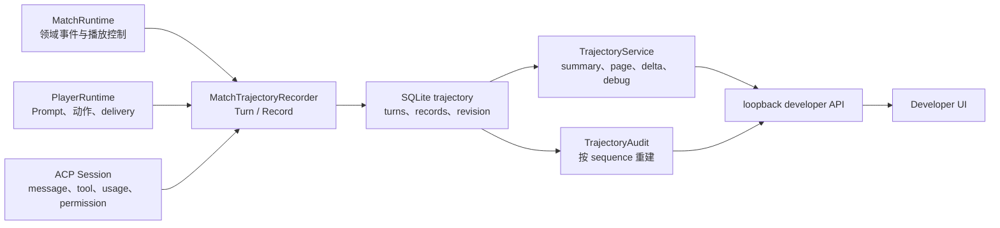
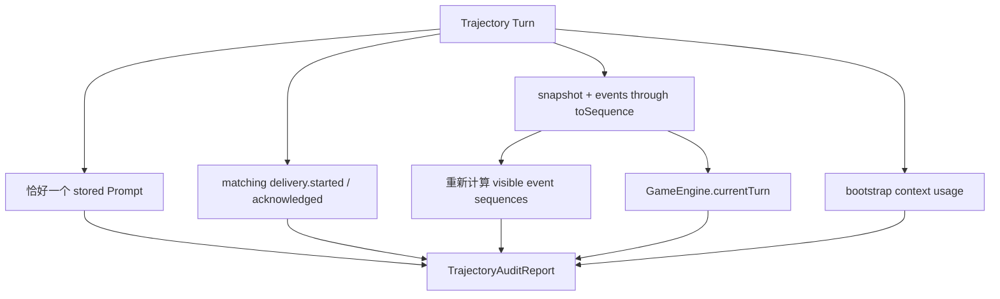

# 轨迹架构

本文描述 AgentWolf 如何记录每次 ACP 回合与系统动作，并通过分页、实时增量、玩家诊断和语义审计
还原运行时发生的事实。目标读者是修改 trajectory schema、recorder、repository、开发者检查器或
audit 的研发人员。轨迹属于诊断状态，不参与 GameEngine 规则求值，也不作为 Match 恢复来源。

## 设计目标与边界

轨迹模块需要保证：

- 每次 Prompt 送达、ACP update、工具调用、动作、错误和 usage 能关联到明确的
  Match、Player、Session 与事件范围；
- 结构化 ACP 元数据中的 secret、凭据和 `_meta` 在持久化前移除，流式内容按字段上限截断；
- Prompt、可见 event sequences 和 usage 以实际发送时内容保存；
- Turn 与 Record 支持增量 upsert、按 owner 分页和 WebSocket revision 追平；
- audit 能在 Turn 的 `toSequence` 处重建 GameState，并检查送达、可见性和 action boundary；
- 开发者诊断不解析 secret value，也不把完整大文本装入概览接口；
- recorder 在普通与 developer 模式中保持相同采集语义，读取接口只在 loopback developer mode 暴露。

`MatchTrajectoryRecorder` 接收 MatchRuntime、PlayerRuntime 与 ACP Session 的运行信号。SQLite
repository 持有轨迹记录；`TrajectoryService` 持有读取、投影和实时订阅；`auditTrajectory` 持有
跨事件与 Turn 的一致性检查。确定性仿真只读消费持久轨迹契约，其采集与 runner 设计见
[仿真架构](simulation.md)。

## 组件与数据流

| 组件                      | 拥有的状态或决策                                                        | 主要产出                                      |
| ------------------------- | ----------------------------------------------------------------------- | --------------------------------------------- |
| `MatchTrajectoryRecorder` | Match 范围的 Turn/Record 创建、system event 与 runtime control 记录     | 持久 Turn/Record 与 revision delta            |
| `TrajectoryTurnRecorder`  | 单次 Turn 的流式合并、tool upsert、usage、完成和失败                    | 一个 Turn 及其有序 Records                    |
| trajectory repository     | per-Match revision、owner/ordinal 索引和 Turn/Record JSON               | 可分页、可增量读取的诊断存储                  |
| `TrajectoryService`       | owner summary、分页、player debug、实时订阅与 speech canonicalization   | contracts 约束的 summary/page/delta/debug DTO |
| `auditTrajectory`         | delivery、Prompt、visible events、actor/action 与 bootstrap budget 检查 | `TrajectoryAuditReport`                       |

## Turn 与 Record 模型

一条 trajectory 由两层组成：

- **Turn** 表示一次可归因的送达或系统动作，保存 owner、Session ID/generation、ordinal、attempt、
  kind、phase/action、event range、visible sequences、渲染时 Match status、continuation、状态、时序、
  error 和 usage。Session generation 表示 durable binding 的逻辑代次，与 Turn attempt 分开。
- **Record** 表示 Turn 内一个稳定步骤，包括 prompt、reasoning、message、tool、permission、action、
  usage、diagnostic、lifecycle 或 error；它保存 step/ordinal、可选 input/output/text、状态和时序。

| 生产信号                            | 记录方式                                     | 合并或完成语义                                      |
| ----------------------------------- | -------------------------------------------- | --------------------------------------------------- |
| ContextEnvelope                     | Turn + 单个 prompt Record                    | 保存实际文本、from/to sequence 与 visible sequences |
| ACP message/thought chunks          | message/reasoning Record                     | 按 channel、message ID 和 tool boundary 追加 delta  |
| tool call/update                    | tool Record                                  | 按 tool-call ID upsert，terminal status 完成时序    |
| permission request                  | permission Record                            | 保存脱敏 input 与 allowed/denied                    |
| accepted action/postgame submission | action Record                                | 保存规范化结构化输入                                |
| usage update                        | Turn usage + usage Record                    | 保留 used、size 与可选 cost                         |
| stderr/诊断                         | diagnostic Record                            | 有界文本与 severity                                 |
| GameEngine events                   | system Turn + lifecycle/action/error Records | 按事件 sequence 和发生时间记录                      |
| playback control                    | system Turn/Record                           | 保存 enable、resolve 与 disconnect                  |

`beginTurn` 在 Prompt 发送前创建 running Turn，并立即保存 prompt Record。Turn 结束时进入 completed、
failed、uncertain 或 cancelled。相同 owner/kind/phase/action/toSequence 的后续尝试增加 attempt；
Record step 在 tool boundary 后推进，使 reasoning、tool 和 message 的时序关系保持可见。

message 与 reasoning 按协议 channel/message ID 合并，文本 delta 只按收到顺序追加。tool call 与
tool update 按 tool-call ID 合并为一条 Record，只有 terminal tool status 设置完成时间。已接受动作
单独记录，便于把 ACP 输出与 MatchRuntime 实际消费的结构化 action 对齐。

## 脱敏与内容边界

轨迹在序列化结构化 input/output 前递归处理内容：

- key 命中 authorization、cookie、credential、password、secret、token、API/private key 时写入
  `[REDACTED]`；
- `_meta` 整体移除，循环对象以标记代替；
- 数组与对象属性数有界，message/tool 和 diagnostic 使用各自截断上限；
- 截断字段写入 `truncatedFields`；
- player debug 只展示 environment binding 来源与 connection key 名；
- launch args 对 bearer、OpenAI key、private key 和敏感参数执行展示侧脱敏。

Prompt 以实际发送文本原样保存，并由 Record schema 施加总长度边界；其上游 facts 不携带
credentials。脱敏后的 input/output 只用于诊断和审计，不用于重新执行 ACP 命令。

## 存储、查询与实时增量

SQLite 使用独立的 trajectory turns、records 和 per-Match revision 表。每次 Turn/Record upsert 先
递增 revision，再把同一 revision 写入记录。owner/ordinal 索引支持 Turn 分页，Turn ID 索引支持只为
当前页批量加载 Records。

`TrajectoryService` 提供四种读取面：

- **summary**：列出 owners、Turn/Record 计数和带 shared timeline group 的 Turns；
- **page**：按 owner 与 beforeTurn 分页，并只加载该页 Turn 的 Records；
- **delta**：按 revision 返回 Turn/Record upserts，并向 WebSocket subscribers 推送；
- **player debug**：组合 Profile/Tool 快照、Session binding、delivery ledger、上下文 usage 与最近 Turn。

没有 subscriber 时，recorder 仍持久化完整记录，service 跳过实时 delta 的 speech
canonicalization。读取页面时，service 使用已提交 speech action 校准对应 message Record，使
检查器展示 GameEngine 接受的权威发言文本。

player debug 与 Record inspector 是两个读取面：前者提供有界运行概览，后者按当前页/当前 Turn
加载详细内容。开发者 UI 通过 revision 先追平变化，再按需读取 Records。

## 语义审计

`auditTrajectory` 对每个非 system Turn 在其 `toSequence` 处用 board snapshot、Ruleset 和领域事件
重建 GameState。审计验证 Agent 送达是否与权威运行时一致，不评价模型策略质量。

审计项目包括：

- Prompt 缺失或重复；
- delivery owner/range 与 Turn 不一致；
- completed Turn 缺少对应 acknowledgement；
- 保存的 visible sequences 与 player/closed-eye projection 不一致；
- action Turn 的 owner 或 action type 不属于该 action boundary；
- 后台 `skill-trigger` Turn 的 owner 不具备当前 Phase 声明的 interrupt capability；
- event replay 失败；
- foundation Provider usage 超过 12,000 token 预算。

postgame Turn 使用 closed-eye 公共历史检查可见性，game-only bootstrap budget 不应用于赛后。
每个 issue 保存稳定 code、Turn ID 和 detail，Developer UI 可以定位到关联 Turn/Record。

## 故障、可观测性与扩展边界

- trajectory schema 或持久化失败沿当前运行链路上抛，completed delivery 的诊断证据不会静默丢失；
- 未知 Match/Player、无效分页 cursor 或错误 owner 在 service 边界拒绝；
- audit 的 reconstruction、visibility、delivery 与 action 问题分别报告，不用单一布尔值掩盖原因；
- 新 ACP update kind 需要定义 Record kind、merge key、终止语义、脱敏与截断策略；
- 新 player debug 字段只暴露非机密、可执行诊断所需的信息；
- 新实时投影保持 revision 单调和 upsert 幂等，不能要求客户端重建全量历史。

## 架构不变量

- 轨迹只观察生产链路，GameEngine 与 Match 恢复不读取 trajectory 作为游戏事实。
- 每个 Prompt Turn 保存实际文本、精确 event range 与 visible sequences。
- 结构化 ACP 元数据的 secret 与 `_meta` 在持久化前过滤，截断必须显式标记。
- message delta 按协议顺序追加，tool 状态按 tool-call ID 合并。
- summary/page/delta/player debug 共享同一持久数据，但各自保持有界读取。
- 历史 Prompt 审计使用发送时记录，不由当前模板重渲染。
- superseded listener 以 cancelled Turn 保留其实际 Prompt 与 event range,不会伪装成失败或权威
  phase actor。

## 深入阅读

- [系统架构](../architecture.md)：诊断流与生产事实流的关系。
- [ACP Session 运行时](acp-session-runtime.md)：Turn、delivery、pending action 和恢复来源。
- [信息同步](information-synchronization.md)：visible sequences 与 playback controls。
- [Match 生命周期](match-lifecycle.md)：trajectory 持久化与删除边界。
- [仿真架构](simulation.md)：仿真如何只读消费 Match、事件和轨迹事实。
- [Server package](../../apps/server/README.md)：trajectory owner map。
