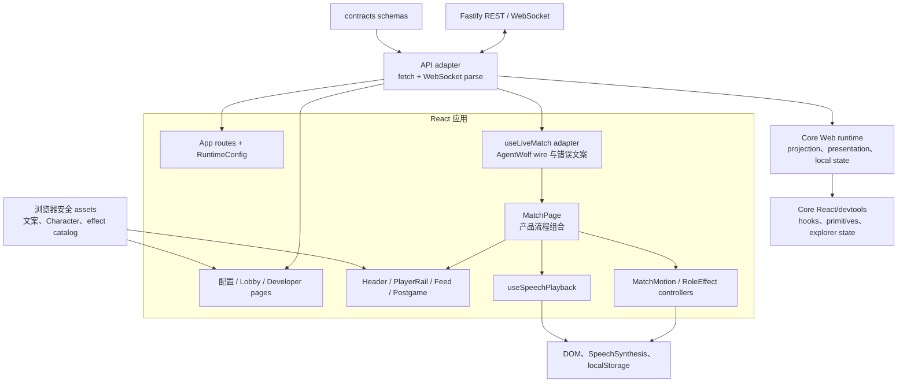
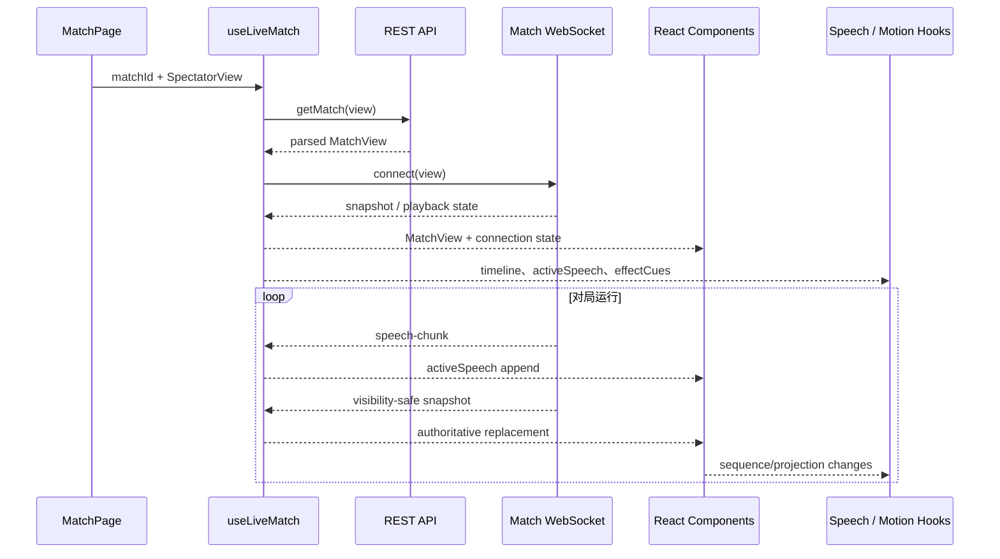

# Web 客户端架构

本文描述 AgentWolf React/Vite 客户端如何消费 visibility-safe REST/WebSocket DTO，组织页面与实时
Match 呈现，并管理 speech、motion、滚动和连接等浏览器副作用。目标读者是修改 API 适配、页面
组合、实时状态、Match UI 或开发者检查器的研发人员。规则、持久化、Prompt 和隐藏信息过滤属于
server 与下层模块。

## 设计目标与边界

Web 客户端同时满足以下约束：

- 所有 server 响应和实时消息先经过 contracts schema，再进入 React state；
- 浏览器只持有某个 `SpectatorView` 的 `MatchView`，不接收完整 Match 后自行隐藏；
- server snapshot 是远端事实，连接、表单、播放、动效、滚动和 modal 是本地交互状态；
- HTTP 提供初始/追平快照，WebSocket 提供实时 snapshot、speech chunks 和播放控制；
- view 切换期间旧投影不可交互，直到新 view snapshot 完成替换；
- speech synthesis 与 motion 可以失败或降级，但不能改变游戏规则或阻塞 Match 永久推进；
- 用户离开 feed 最新位置后，实时更新保留其自由滚动位置并显式提示新活动；
- developer UI 只在 server 宣告的 developer mode 中出现。

[`apps/web`](../../apps/web/README.md) 在 AgentWolf packages 中只依赖 contracts 与 assets 的浏览器安全
入口。Prompt runtime、玩家 Skill builder、GameEngine、SQLite 和 ACP 不进入 Web bundle。跨游戏
live/presentation/local-state controllers、React primitives 与 devtools state 来自固定 Core revision；
AgentWolf adapters 提供 wire、View、copy、class names 与领域 renderer。

## 组件与依赖

下图按状态所有权展示浏览器内部结构，而不是文件目录。

| 层                        | 主要职责                                                    | 状态边界                               |
| ------------------------- | ----------------------------------------------------------- | -------------------------------------- |
| `src/api.ts`              | 发起 HTTP、规范错误、逐响应 Zod parse                       | 不缓存 Match，不解释业务状态           |
| App routes/runtime config | 组合导航、lazy Match route、developer capability gate       | 只保存 server 宣告的本次运行能力       |
| Pages                     | 加载目录、维护表单 draft、调用生命周期 API、组合产品流程    | 表单状态可丢弃，不成为 server 配置真相 |
| Core live controller      | HTTP port、typed channel、view 切换、追平、退避与 MatchView | 唯一实时远端状态 owner                 |
| `useLiveMatch`            | 解析 AgentWolf wire、注入 View/终局/error adapters          | 不复制连接状态机                       |
| MatchPage                 | 组合当前 projection、动作按钮、review panel 与呈现控制      | 不复制 server reducer                  |
| Components                | 可复用渲染、可访问交互、局部展开/滚动状态                   | 不发明隐藏字段或 Match 状态            |
| Core/产品 controllers     | speech、follow-latest、cue、GSAP 与 local preference        | 通用状态与产品 renderer 分离           |

## API 与路由边界

`requestJson` 将非 2xx 响应转换为带 HTTP status 的 `ApiError`；204 返回 null，其余 JSON 交给调用
方法对应的 contracts schema。目录、Match、postgame、trajectory 和 simulation 方法都返回解析后的
类型，页面不直接处理未校验 `unknown`。

应用路由分为两种外壳：

- setup、Agent/Profile、board、Character、settings、Lobby 和 developer 页面位于共享 `AppShell`；
- Match 页面使用独立全视口外壳并 lazy load，避免常规导航布局介入实时舞台。

Board 页面把 Role 数量编辑为完整身份牌池,并单独维护零至两张底牌;席位数由两者之差派生,逐 Seat
Profile/Character defaults 随席位数调整。新建 Match 的手动模式把 Seat 与底牌显示为同一 multiset
中的可交换卡槽,最终仍由 server 对牌池、Role plugin 要求与合法 deal 进行权威校验。

启动时 `RuntimeConfigProvider` 读取 `/api/runtime-config`。developer route 只有在
`developerMode=true` 时可达；该值只决定客户端导航，真正的 developer API 注册与访问控制仍由
server 启动配置拥有。

## 远端状态与本地状态

Web 客户端不维护一份平行 GameState。主要状态归属如下：

| 状态                                                  | 所有者                       | 更新/失效方式                                                  |
| ----------------------------------------------------- | ---------------------------- | -------------------------------------------------------------- |
| Match status、phase、Seat、timeline、winner、postgame | server `MatchView`           | HTTP 或 WebSocket snapshot 整体替换                            |
| 流式 `activeSpeech`                                   | `useLiveMatch`               | speech-chunk 追加，后续 snapshot 规范化为 committed 状态       |
| `connecting/live/reconnecting/settled/unavailable`    | Core live controller         | typed channel、HTTP port、404 和完整终局驱动                   |
| 当前 SpectatorView                                    | MatchPage                    | header 选择；server 返回对应 projection 后生效                 |
| `viewPending`                                         | `useLiveMatch`               | 请求 view key 与 loaded snapshot view key 不同                 |
| 自动/手动 speech queue                                | Core presentation controller | projection、speech events、browser port 与 server barrier 驱动 |
| Role effect baseline/queue                            | `RoleEffectController`       | projection key、lastSequence、mode 与 cleanup 驱动             |
| presence/motion                                       | 纯派生 + GSAP controllers    | MatchView、连接和 speech 状态变化时重算                        |
| feed 展开、following-latest、scrollTop                | `MatchFeed`                  | 用户输入和新增 timeline/stream 驱动                            |
| 表单 draft、modal、busy/error                         | 各 page/component            | 提交、取消、路由卸载时失效                                     |

这一划分使断线时可以保留最后 MatchView，同时独立清理 WebSocket、speech 和 motion 资源；重连完成
后只需用新 snapshot 替换远端投影。

## 实时 Match 数据流

`useLiveMatch` adapter 解析 URL Match ID，并把 HTTP loader、WebSocket channel、view key、transient
reducer 与终局判断注入 Core live controller。controller 并发启动初始加载和 channel；channel 已产生
新 snapshot 时，迟到的旧 load 不会覆盖它。speech-chunk 只对 `activeSpeech` 做临时追加，最终
`speech.committed` snapshot 重新建立规范 timeline。playback state 与 MatchView 分离，因为它属于
连接 owner 而非领域投影。

socket error 统一触发 close。close 后 hook 保留 MatchView，HTTP 追平当前 view，再以 250ms 到 5s
退避重连。HTTP 404 清空 Match 并进入 unavailable；Match ended 且 postgame 完成/跳过（或不存在）
进入 settled 并停止重连。

### View 切换

MatchPage 保存 `god/player/closed-eye` 和 player ID。view 改变时：

1. hook 发送 `view.set`，并保持旧 snapshot 仅用于避免页面闪空；
2. `loadedViewKey` 与请求 key 不同，`viewPending=true`；
3. stage 设置 `aria-hidden` 与 `inert`，旧投影不能被读取或操作；
4. server 回传新 view snapshot 后，hook 更新 MatchView 和 loaded key；
5. speech 和 Role effect hooks 以新 projection key 重建基线。

这是 UI 的过渡保护；真正的 privacy 仍由 server projection 保证。

## Match 页面组合

MatchPage 只组合已投影信息：

- Header：board/phase、连接状态、view、audio 和 effect mode；
- PlayerRail：公开 Character、Role、alive、Sheriff、候选、投影授权的玩家标识和有限 Session status；
- PresenceStage：从 Match status、postgame、连接、Session 和 speech 纯派生活动文案；
- MatchFeed：timeline、live speech、vote detail、postgame award/reflection；
- PostgameReviewPanel：countdown、评分进度、结果、感想与 start/skip/resume action；
- paused/ended controls：调用 server API 后重新加载，不直接修改 MatchView。

`deriveMatchPresenceState` 产生 starting、thinking、streaming、narrating、resolving、reconnecting、paused、
ended 等呈现状态。它只影响文案和 motion，不能触发 GameEngine transition。

## Feed 与滚动所有权

MatchFeed 按对局周期把 timeline 组织为 setup、day/night 和 postgame groups，并只把展开集合保存在
本地。公开 speech、vote 和 system event 使用不同组件，但都由 server 已生成的 TimelineItem 驱动。

MatchFeed 与 trajectory ledger 共享 Core follow-latest controller，并分别连接普通 DOM 与 virtualizer。
滚动策略显式区分“跟随最新”和“用户阅读历史”：

- 初始位于底部或距离底部小于阈值时，新增 sequence、stream text 或 postgame result 通过下一帧
  滚到最新；
- 用户 pointer down、向上滚轮、PageUp/Home/ArrowUp 后立即取消待执行 scroll frame，并设置
  `detachedByUser`；
- detached 状态下，timeline 和虚拟 DOM 更新不修改用户 `scrollTop`，只显示“回到最新”提示；
- 用户自行回到底部或点击提示后恢复 following-latest。

因此 selected/active 内容可以在进入时定位一次，但实时 stream、group 展开和后续更新不会夺回用户
滚动控制。

## Speech playback

`useSpeechPlayback` 将 AgentWolf TimelineItem、中文断句和 copy 映射到 Core presentation controller；
显式 browser speech port 是 SpeechSynthesis 的唯一 owner。controller 接收 server playback state、
timeline、activeSpeech、projection key 和 viewPending，并维护：

- committed speech queue；
- 当前 stream job、已消费字符和完整句 units；
- sequence outcome 与已回执 barrier 集；
- 自动与手动播放互斥状态。

流式 speech 只在完整句子形成时入队，commit 后补齐剩余尾部，并把最终 sequence 绑定到整个 stream。
合成 end 回执 completed；error、unsupported、显式 skip、view pending 或控制权丢失回执 skipped。每个
pending sequence 只发送一次 `speech-playback.resolve`。手动播放不连接 server barrier。

projection 切换先取消 browser engine 和队列，记录被中断 sequence；新 view snapshot 到达后，只在
该 sequence 仍可见或仍为 server pending 时重播。组件卸载、控制关闭和 Match 终局都会 cancel 当前
utterance。

## Motion 与 Role effects

所有 GSAP 依赖通过 `src/motion/gsap.ts` 进入，版本由架构门禁固定。motion 分为两类：

- `MatchMotionController` 根据 presence、phase、lastSequence、Sheriff 和 Session state 执行 ambient、
  status、feed entry 与 FLIP transition；
- `RoleEffectController` 消费 server 投影的 semantic `RoleEffectCue`，再从 assets catalog 读取 icon、
  duration、tier 和样式。

Role effect renderer 使用 Core sequenced cue queue，只接受大于当前 baseline 的 cues，按 sequence
排序并用 cue ID 去重。首次加载和
projection key 变化把 baseline 设为当前 `lastSequence`，避免播放历史事件。mode 为 full、reduced 或
off；系统 reduced-motion 关闭连续/强 motion，off 同时推进 baseline，后续开启不会补播。

GSAP timeline 在依赖变化时 revert，并清理 player dataset、tweens、visibility listener 和 DOM 状态。
动画完成或失败不回写 server，也不持有 Match phase。

## Developer UI

developer 页面以 lazy chunk 组合 Core trajectory explorer state、AgentWolf record renderer、player
Session/delivery debug 与领域 audit。Core state 负责 summary/page、owner、revision delta、分页、query
和 selection。AgentWolf 使用 complete initial-page mode：切换 owner 时先遍历全部历史页、刷新一次 head，
再从最新 revision 建立 delta subscription，因此 minimap、搜索和 audit 定位面对完整轨迹且不会漏掉分页
期间产生的记录。

simulation wizard 同样位于 developer-only lazy chunk，通过 Core review state 执行 review、warning、
accept-current 与 approve。AgentWolf adapter 只传 Match ID 和当前 REST DTO；客户端不上传 fixture
内容、不接受文件路径，也不在浏览器执行 runner。

## 故障与降级

- API schema 失败或 HTTP error 保留在 page/hook error state，用户可以显式 retry；客户端不使用
  未校验 payload 继续渲染。
- WebSocket 解析错误显示连接错误，socket 关闭后走统一追平；已知 live control error 使用稳定文案。
- SpeechSynthesis 不可用、抛错或回调 error 时自动 skip barrier，并保留文字内容。
- reduced motion/off 模式保留完整语义 UI；动效缺失不影响操作和 Match progression。
- 未知/删除 Match 收敛为不可用，不进行无界 reconnect。
- 所有 effect、speech、timer、animation frame、event listener 和 socket 在 hook/component cleanup 中
  释放。

## 扩展边界与不变量

- 新 server 字段先进入 contracts schema 和 server projector，再由 `api.ts`/LiveMessage parser 消费。
- 新隐藏事实不能通过 Web 条件过滤实现；必须在 server serialization 前移除。
- 新页面流程留在 pages，可复用交互留在 components，浏览器副作用留在 hooks/controllers。
- 新 Role motion 由 semantic cue、assets definition 和 full/reduced 行为组成，不把 DOM/动画指令写入
  game events。
- server snapshot 是远端权威；Web 不能自行推进 phase、结算 vote、恢复 Session 或改写 postgame。
- view pending 时旧投影不可交互；speech/effect sequence 在 projection 变化时重新建基线。
- 用户显式离开最新位置后，任何实时更新都不能强制改变其滚动位置。
- speech 与 motion 失败必须可降级且完成 cleanup，不能阻塞或改变游戏事实。

## 深入阅读

- [系统架构](../architecture.md)：Web 在跨包依赖和端到端回合中的位置。
- [信息同步](information-synchronization.md)：projection、barrier、WebSocket 与播放门控协议。
- [Match 生命周期](match-lifecycle.md)：页面可触发的 lifecycle 与 postgame 状态。
- [轨迹](trajectory.md)：Developer UI 的 summary、page、delta、debug 与 audit 数据源。
- [仿真](simulation.md)：simulation wizard 的 candidate、review 与 approve 契约。
- [前端方向](../frontend.md)：视觉语言、响应式布局和动效品味。
- [Web package](../../apps/web/README.md)：页面、组件、hook 和验证归属。
- [Core Web runtime](../../vendor/agent-arena-core/packages/web-runtime/README.md)：连接、presentation 与
  本地交互状态机。
- [测试与验收](../testing.md)：jsdom 与 Playwright 的行为边界。
